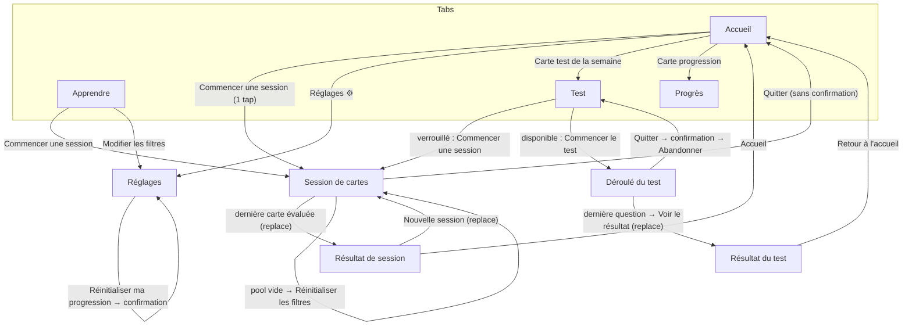

# Design — VocaBoost v1

> Rédigé selon `.claude/agents/designer.md`. Entrées : `docs/01-brief-client.md`, `docs/02-spec-pm.md` (source de vérité : en cas d'écart, la spec PM prévaut). Destinataires : Développeur, QA.
> Mode clair uniquement. Aucune librairie d'icônes : emoji ou texte seulement. Les références `RG-xx` / `AC-xx` renvoient à la spec PM.

---

## 1. Flux d'écrans

### 1.1 Arborescence expo-router

```
app/
  _layout.tsx            Stack racine (headers natifs, fond bg)
  (tabs)/_layout.tsx     Tabs : Accueil | Apprendre | Progrès | Test
  (tabs)/index.tsx       Accueil
  (tabs)/learn.tsx       Apprendre
  (tabs)/progress.tsx    Progrès
  (tabs)/test.tsx        Test (état + historique)
  session.tsx            Session de cartes      (Stack, gestureEnabled: false)
  session-result.tsx     Résultat de session    (Stack, router.replace depuis session)
  test-run.tsx           Déroulé du test        (Stack, gestureEnabled: false)
  test-result.tsx        Résultat du test       (Stack, router.replace depuis test-run)
  settings.tsx           Réglages               (Stack, header « Réglages »)
```

Les écrans empilés masquent la barre d'onglets. `session` et `test-run` désactivent le geste/bouton retour natif (Android : `BackHandler` → même comportement que « Quitter »).

### 1.2 Diagramme



Règles de navigation :
- « Quitter » une session : **pas de confirmation** (rien n'est perdu, RG-14/34) → `router.back()` vers l'onglet d'origine.
- « Quitter » un test : **confirmation obligatoire** (le test en cours est perdu, RG-67).
- Résultats (session/test) : retour natif = même action que le bouton principal de retour (« Accueil » / « Retour à l'accueil ») ; jamais de retour vers la dernière carte/question.

---

## 2. Design system

### 2.1 Couleurs (tokens)

Contrastes calculés sur fond `surface` (#FFFFFF) sauf mention. Texte normal ≥ 4.5:1, éléments d'interface ≥ 3:1 (WCAG AA).

| Token | Hex | Usage | Contraste |
|---|---|---|---|
| `bg` | `#F6F7FB` | Fond des écrans | — |
| `surface` | `#FFFFFF` | Cartes, boutons secondaires, onglets | — |
| `surfaceAlt` | `#EEF0F6` | Pistes de ProgressBar, zones neutres | — |
| `border` | `#D9DCE5` | Séparateurs décoratifs uniquement | décoratif |
| `borderStrong` | `#6B7280` | Contours d'éléments interactifs (Chip, OptionButton, Button secondaire) | 4.8:1 |
| `text` | `#111827` | Texte principal, titres | 17.7:1 |
| `textMuted` | `#4B5563` | Texte secondaire, légendes | 7.6:1 |
| `textOnColor` | `#FFFFFF` | Texte sur primary/success/danger | voir lignes ci-dessous |
| `primary` | `#4338CA` | Bouton primaire, onglet actif, liens, Chip sélectionnée | 7.9:1 (blanc dessus : 7.9:1) |
| `primaryPressed` | `#3730A3` | État pressé du primaire | 9.6:1 |
| `primarySoft` | `#E0E7FF` | Fond Chip sélectionnée, badge, sélection | `primaryPressed` dessus : 7.6:1 |
| `success` | `#15803D` | Bonne réponse (bordure + texte), barre « maîtrisés », « Réussi » | 5.0:1 (blanc dessus : 5.0:1) |
| `successSoft` | `#DCFCE7` | Fond option correcte | `#14532D` dessus : 9.9:1 |
| `successText` | `#14532D` | Texte sur `successSoft` | — |
| `danger` | `#B91C1C` | Mauvaise réponse, bouton danger, « À retravailler » | 6.5:1 (blanc dessus : 6.5:1) |
| `dangerSoft` | `#FEE2E2` | Fond option incorrecte | `#7F1D1D` dessus : 9.4:1 |
| `dangerText` | `#7F1D1D` | Texte sur `dangerSoft` | — |
| `warning` | `#B45309` | Série (🔥 + nombre), état verrouillé | 5.0:1 |
| `warningSoft` | `#FEF3C7` | Fond bandeau verrouillé / info | `#78350F` dessus : 9.2:1 |
| `disabledBg` | `#E5E7EB` | Fond bouton désactivé | — |
| `disabledText` | `#6B7280` | Texte désactivé (sur `disabledBg` : 4.0:1 — exempté AA car inactif, reste lisible) | — |
| `overlay` | `rgba(17,24,39,0.5)` | Fond derrière une boîte de dialogue custom | — |

Règle : la couleur n'est **jamais** le seul signal. Bonne/mauvaise réponse portent aussi un symbole texte (« ✓ » / « ✗ ») et un libellé d'accessibilité.

Badges de niveau (fond `primarySoft`, texte `primaryPressed`) : identiques pour A1→B2, seul le texte change (pas de code couleur par niveau).

### 2.2 Typographie

Police système (San Francisco / Roboto), aucune police à charger. `allowFontScaling` activé partout ; `maxFontSizeMultiplier = 1.6` sur le mot de la Flashcard et les chiffres des StatTile.

| Token | Taille / interligne | Poids | Usage |
|---|---|---|---|
| `display` | 40 / 48 | 700 | Mot anglais sur la Flashcard, score du test |
| `h1` | 28 / 34 | 700 | Titre d'écran (onglets) |
| `h2` | 22 / 28 | 700 | Titre de section, mot de la question QCM |
| `h3` | 18 / 24 | 600 | Titre de Card, libellé de bouton large |
| `body` | 16 / 24 | 400 | Texte courant, options QCM, phrase d'exemple |
| `bodyStrong` | 16 / 24 | 600 | Libellés de bouton, valeurs inline |
| `caption` | 13 / 18 | 500 | Légendes, badges, « Carte 3 / 10 », dates |
| `stat` | 32 / 38 | 700 | Valeur d'un StatTile |

Phrase d'exemple : `body` en italique, couleur `textMuted`. Traduction FR au verso : `h2`, couleur `primary`.

### 2.3 Espacements (échelle 4 pt)

| Token | Valeur |
|---|---|
| `xs` | 4 |
| `sm` | 8 |
| `md` | 12 |
| `lg` | 16 |
| `xl` | 24 |
| `xxl` | 32 |
| `xxxl` | 48 |

- Marge horizontale des écrans : `lg` (16). Espace entre sections : `xl` (24). Entre éléments d'une liste/Card : `md` (12).
- Padding interne Card : `lg` (16) ; Flashcard : `xl` (24).
- Contenu dans `SafeAreaView` ; boutons d'action fixés en bas avec padding bas `lg` + inset de sécurité.

### 2.4 Rayons

| Token | Valeur | Usage |
|---|---|---|
| `radiusSm` | 8 | Badges, ProgressBar (pistes : `radiusPill`) |
| `radiusMd` | 12 | Boutons, OptionButton, Chip carrée |
| `radiusLg` | 16 | Card, StatTile |
| `radiusXl` | 24 | Flashcard |
| `radiusPill` | 999 | Chip de filtre, ProgressBar |

### 2.5 Ombres

| Token | iOS | Android | Usage |
|---|---|---|---|
| `shadowSm` | `shadowColor #111827, opacity 0.06, radius 4, offset {0,1}` | `elevation 1` | Card, StatTile |
| `shadowMd` | `shadowColor #111827, opacity 0.10, radius 12, offset {0,4}` | `elevation 4` | Flashcard, bouton primaire fixé en bas |

Pas d'ombre sur les éléments désactivés ni sur OptionButton (bordure seulement).

### 2.6 Tailles et cibles

- Toute cible tactile ≥ **44 × 44 pt** (utiliser `hitSlop` si l'élément visuel est plus petit, ex. bouton 🔊 de 36 pt → `hitSlop` 4).
- Hauteur Button : 52 (taille `lg`) / 44 (taille `md`). OptionButton : min 56. Chip : 44. Barre d'onglets : hauteur système.
- Largeur des boutons d'action principaux : pleine largeur (moins les marges).

---

## 3. Composants réutilisables

Fichiers suggérés : `components/ui/*.tsx`, tokens dans `theme/tokens.ts` (exports `colors`, `spacing`, `radius`, `typography`, `shadows`).

### 3.1 Button

Props : `label: string`, `onPress()`, `variant: 'primary' | 'secondary' | 'danger'` (défaut `primary`), `tone?: 'default' | 'success'` (primary seulement : fond `success`, pressé `#166534`), `size: 'md' | 'lg'` (défaut `lg`), `disabled?: boolean`, `loading?: boolean`, `leftEmoji?: string`, `accessibilityLabel?: string`, `accessibilityHint?: string`, `testID?: string`.

| Variante | Fond | Texte | Bordure | Pressé |
|---|---|---|---|---|
| primary | `primary` | `textOnColor` | — | fond `primaryPressed` |
| secondary | `surface` | `primary` | 1.5 `borderStrong` | fond `primarySoft` |
| danger | `danger` | `textOnColor` | — | opacité 0.85 |
| désactivé (toutes) | `disabledBg` | `disabledText` | — | aucun retour |

Comportement : `Pressable`, `accessibilityRole="button"`, `accessibilityState={{ disabled, busy: loading }}`. `loading` affiche un `ActivityIndicator` de la couleur du texte et bloque les taps. Anti-double-tap : ignorer un second tap tant que l'action synchrone n'est pas terminée (important pour « Je savais » / « Suivant »).

### 3.2 Card

Props : `children`, `onPress?()`, `title?: string`, `accessibilityLabel?: string`, `style?`.
Fond `surface`, `radiusLg`, padding `lg`, `shadowSm`. Si `onPress` : `accessibilityRole="button"`, opacité 0.9 au pressé, chevron texte « › » à droite du titre.

### 3.3 Flashcard (retournement)

Props : `word: { en, fr, example, level, categoryLabel }`, `index: number`, `total: number`, `flipped: boolean`, `onFlip()`, `onSpeak?(text: string)` (P2, absent → boutons 🔊 masqués).

- Zone carte : `surface`, `radiusXl`, `shadowMd`, padding `xl`, hauteur min 320, centrée.
- **Recto** : en haut ligne `caption` « Carte {n} / {N} » (gauche) + badge niveau + catégorie (droite) ; centre : mot EN en `display` ; sous le mot (P2) bouton 🔊 ; bas : texte `caption` `textMuted` « Touchez la carte pour la retourner ».
- **Verso** : mot EN (`h2`, `text`) + 🔊 ; séparateur `border` ; traduction FR (`h2`, `primary`) ; phrase d'exemple (`body` italique `textMuted`) + 🔊 phrase.
- Animation : rotation Y 0→180° en **300 ms** (`Animated` natif, `backfaceVisibility: 'hidden'`, deux faces superposées). Si « Réduire les animations » est actif (`AccessibilityInfo.isReduceMotionEnabled`) : fondu enchaîné 150 ms.
- Le retournement est **à sens unique** dans une carte (une fois retournée, un tap ne revient pas au recto) — évite d'évaluer recto visible.
- Accessibilité : la carte est un bouton tant que non retournée, `accessibilityLabel="Mot anglais : {en}. Niveau {level}, {catégorie}. Carte {n} sur {N}"`, `accessibilityHint="Touchez deux fois pour voir la traduction"`. Après retournement : annoncer `"Traduction : {fr}. Exemple : {example}"` (`AccessibilityInfo.announceForAccessibility`).
- À chaque nouvelle carte : remise à `flipped=false` sans animation, arrêt TTS (RG-81).

### 3.4 ProgressBar

Props : `value: number` (0–1, borné), `color?: 'primary' | 'success'` (défaut `primary`), `height?: 8 | 12` (défaut 8), `accessibilityLabel: string`.
Piste `surfaceAlt`, remplissage couleur, `radiusPill`. Valeur > 1 (objectif dépassé) → barre pleine. Animation de largeur 250 ms au changement (sauf réduction des animations). `accessibilityRole="progressbar"`, `accessibilityValue={{ min: 0, max: 100, now: floor(value*100) }}`.

### 3.5 StatTile

Props : `value: string | number`, `label: string`, `emoji?: string`, `sublabel?: string`, `tone?: 'default' | 'success' | 'warning'`.
Fond `surface`, `radiusLg`, `shadowSm`, padding `lg`, min hauteur 96. Ligne 1 : emoji + valeur (`stat`, couleur selon tone : `text` / `success` / `warning`). Ligne 2 : `label` (`caption`, `textMuted`). `sublabel` optionnel en `caption`. Groupé (`accessible`) avec `accessibilityLabel="{label} : {value} {sublabel}"`. Utilisé en grille 2 colonnes (gap `md`).

### 3.6 Chip de filtre

Props : `label: string`, `selected: boolean`, `onToggle()`, `locked?: boolean` (dernier élément sélectionné du groupe).

| État | Fond | Texte | Bordure |
|---|---|---|---|
| non sélectionné | `surface` | `text` | 1.5 `borderStrong` |
| sélectionné | `primarySoft` | `primaryPressed`, préfixe « ✓ » | 1.5 `primary` |
| verrouillé (sélectionné, dernier) | idem sélectionné | idem | idem |

Hauteur 44, padding horizontal `lg`, `radiusPill`, disposés en `flexWrap` (gap `sm`). Tap sur une chip `locked` : aucun changement + toast/texte d'aide inline sous le groupe « Garde au moins un élément sélectionné. » (3 s) — RG-50. `accessibilityRole="checkbox"`, `accessibilityState={{ checked: selected }}`.

### 3.7 OptionButton (QCM)

Props : `label: string`, `state: 'idle' | 'correct' | 'incorrect' | 'disabled'`, `onPress()`, `index: number` (pour l'ordre de lecture).

| État | Fond | Bordure | Texte | Marqueur droite |
|---|---|---|---|---|
| idle | `surface` | 1.5 `borderStrong` | `text` | — |
| idle pressé | `primarySoft` | 2 `primary` | `text` | — |
| correct | `successSoft` | 2 `success` | `successText` 600 | « ✓ » `success` |
| incorrect | `dangerSoft` | 2 `danger` | `dangerText` 600 | « ✗ » `danger` |
| disabled | `surface` | 1.5 `border` | `textMuted` | — |

Pleine largeur, min hauteur 56, `radiusMd`, padding `lg`, texte `body` sur 2 lignes max. Une fois une réponse choisie, **toutes** les options passent à `correct` (la bonne), `incorrect` (celle choisie si fausse) ou `disabled` (les autres) et ne sont plus pressables. Accessibilité : `accessibilityRole="button"`, label « Option {i} : {label} » ; après réponse, label suffixé « , bonne réponse » / « , ta réponse, incorrecte ».

### 3.8 EmptyState

Props : `emoji: string`, `title: string`, `message?: string`, `actionLabel?: string`, `onAction?()`.
Centré, padding `xl` : emoji 48 pt (`accessible={false}`), `title` en `h3`, `message` en `body` `textMuted` centré, puis Button `secondary` (ou `primary` si c'est l'unique action de l'écran).

### 3.9 Composants annexes

- **Badge** : `caption`, fond `primarySoft`, texte `primaryPressed`, `radiusSm`, padding `xs`/`sm`. Variantes `success` (`successSoft`/`successText`) et `danger` (`dangerSoft`/`dangerText`) pour « Réussi » / « À retravailler ».
- **ConfirmDialog** : utiliser `Alert.alert` natif (titre, message, 2 boutons ; bouton destructif avec `style: 'destructive'` sur iOS, `cancelable: true` sur Android = Annuler).
- **SegmentedControl** (Réglages, objectif) : 3 segments « 10 », « 20 », « 30 », hauteur 44, segment actif fond `primary` texte blanc, inactifs fond `surface` texte `text`, bordure `borderStrong`. `accessibilityRole="radio"` par segment.
- **ScreenHeader** des onglets : titre `h1`, marge haute `lg`.

---

## 4. Écrans

Conventions : `{x}` = valeur dynamique. Pluriels gérés (« 1 mot » / « 2 mots », « 1 jour » / « 3 jours », 0 → pluriel sauf « 0 jour »). Chargement global : tant que le store Zustand n'est pas réhydraté (`hasHydrated=false`), afficher un écran neutre (`bg` + `ActivityIndicator` `primary` centré) — pas de chiffre faux affiché. Erreur de lecture (RG-93) : état vierge silencieux, pas de message.

### 4.0 Barre d'onglets

| Onglet | Libellé | Emoji | Route |
|---|---|---|---|
| 1 | Accueil | 🏠 | `(tabs)/index` |
| 2 | Apprendre | 📚 | `(tabs)/learn` |
| 3 | Progrès | 📈 | `(tabs)/progress` |
| 4 | Test | 📝 | `(tabs)/test` |

Actif : libellé + emoji, texte `primary` 600 ; inactif : `textMuted`, emoji opacité 0.6. `tabBarAccessibilityLabel` = libellé. Pastille sur l'onglet Test (point `primary` 8 pt) quand le test est **disponible**.

### 4.1 Accueil

**Objectif** : lancer une session en 1 tap (US-01) et voir l'essentiel d'un coup d'œil (AC-04.1).

**Hiérarchie** (de haut en bas, scrollable, bouton principal visible sans scroll sur un écran 667 pt) :
1. En-tête : titre `h1` « Bonjour 👋 » ; à droite bouton texte « ⚙️ » (`accessibilityLabel="Réglages"`, 44×44) → Réglages.
2. Card « Aujourd'hui » : ligne « Objectif du jour » + valeur `{x} / {objectif}` (bodyStrong) ; ProgressBar (`success` si atteint) ; sous-texte : non atteint « Encore {objectif − x} cartes pour atteindre ton objectif » / atteint « Objectif atteint ✅ ».
3. Grille 2 StatTile : « 🔥 {série} » label « Série actuelle » (`warning`, sublabel « jours » / « jour ») ; « {pct} % » label « Mots maîtrisés » (sublabel « {maîtrisés} / 200 ») → tap ouvre Progrès.
4. Bouton primaire `lg` « Commencer une session ».
5. Ligne filtre (si un filtre est actif, RG-53) : `caption` `textMuted` « Filtres : {n} catégories, {niveaux} » + lien « Modifier » → Réglages. Format niveaux : liste contiguë « A1-A2 », sinon « A1, B1 » ; catégories : « 1 catégorie » / « {n} catégories » ou le nom si une seule (« Filtres : Voyage, A1 »). Masqué si tout est sélectionné.
6. Card « Test de la semaine » (tap → onglet Test) selon état :
   - verrouillé : « 🔒 Étudie encore {X} mots pour débloquer le test de la semaine » ;
   - disponible : « ✨ Ton test de la semaine est disponible » + Button secondary `md` « Passer le test » ;
   - terminé : « ✅ Test de la semaine terminé : {x}/{N} » + `caption` « Prochain test disponible lundi ».

**États** :
- Premier lancement (0 vu) : série 0, « 0 % », objectif « 0 / 10 », test verrouillé « Étudie encore 10 mots… ». Pas d'EmptyState : le bouton principal suffit ; sous-titre sous « Bonjour 👋 » : « Prêt pour tes 10 premiers mots ? ».
- Pool filtré vide : le bouton reste actif ; l'écran Session affiche l'état vide (RG-22).
- Chargement : écran neutre (cf. conventions).

### 4.2 Apprendre (onglet)

**Objectif** : point d'entrée « apprentissage » : rappeler ce que contiendra la session et les filtres, sans dupliquer les Réglages.

**Hiérarchie** :
1. Titre `h1` « Apprendre ».
2. Card « Ta prochaine session » : `body` « 10 cartes tirées au hasard, en priorité les mots que tu ne maîtrises pas encore. » ; ligne `caption` « Mots disponibles avec tes filtres : {k} » (k = taille du pool filtré).
3. Card « Filtres » : résumé « Catégories : {Toutes | liste ou n} » / « Niveaux : {Tous | liste} » + Button secondary `md` « Modifier les filtres » → Réglages (section filtres).
4. Card « Comment ça marche » (texte court, 3 lignes) :
   « 1. Lis le mot anglais et cherche sa traduction.
   2. Retourne la carte pour vérifier.
   3. Dis honnêtement si tu savais : l'app adapte tes révisions. »
5. Bouton primaire `lg` fixé en bas « Commencer une session ».

**États** :
- Pool vide (k = 0) : la Card 2 est remplacée par EmptyState 🔎 « Aucun mot ne correspond à tes filtres » + bouton « Réinitialiser les filtres » ; bouton principal désactivé.
- Pool < 10 : `caption` supplémentaire « Ta session contiendra {k} cartes. »

### 4.3 Session de cartes (empilé)

**Objectif** : réviser 10 cartes vite, sans distraction (US-02, US-03).

**Hiérarchie** :
1. Header custom : bouton texte « Quitter » (gauche, 44 pt, `primary`) ; ProgressBar `primary` (n−1)/N au centre (`accessibilityLabel="Progression de la session : carte {n} sur {N}"`).
2. Flashcard (3.3), centrée verticalement.
3. Zone d'actions en bas (hauteur fixe 120, pour éviter un saut de mise en page) :
   - avant retournement : Button primary « Retourner » ;
   - après retournement : deux boutons côte à côte (gap `md`, largeurs égales) : gauche danger « ✗ Je ne savais pas », droite **primary vert** — utiliser la variante `primary` avec fond `success` (prop `tone="success"` acceptée par Button) « ✓ Je savais ». Ordre de lecture : « Je savais » puis « Je ne savais pas » (positionner visuellement à droite le positif).

**Comportements** :
- Tap carte ou « Retourner » → retournement (RG-31). Boutons d'évaluation absents avant (AC-03.3).
- Tap évaluation → persistance immédiate (RG-14), petite vibration légère optionnelle (`Vibration` natif 10 ms ; pas de lib), carte suivante en glissement horizontal 200 ms (fondu si réduction d'animations).
- Dernière carte évaluée → `router.replace('/session-result')`.
- « Quitter » → retour immédiat sans confirmation (les stats à jour suffisent comme retour).
- Retour Android / geste iOS = « Quitter ».

**États** :
- Chargement (tirage) : instantané (local) ; pas de spinner. Si le tirage prend > 100 ms afficher `ActivityIndicator`.
- **Vide** (pool = 0, RG-22) : EmptyState 🔎 titre « Aucun mot ne correspond à tes filtres », message « Élargis ta sélection de catégories ou de niveaux. », action « Réinitialiser les filtres » (remet tout coché, puis tire une session et affiche la 1re carte) ; header « Quitter » conservé.
- Session courte (k < 10) : « Carte n / k » ; aucun message spécifique.
- Terminé : redirection vers Résultat.

### 4.4 Résultat de session (empilé)

**Objectif** : valoriser l'effort et relancer (RG-35, AC-03.8).

**Hiérarchie** :
1. Emoji 48 « 🎉 » (si ≥ 50 % de « Je savais ») sinon « 💪 » ; titre `h1` « Session terminée ».
2. Grand score `display` « {connus} / {N} », légende `caption` « mots que tu savais ».
3. StatTile « ⭐ {m} » label « Nouveaux mots maîtrisés » (m = mots dont la boîte a atteint 4 pendant la session ; tone `success` si m > 0).
4. Card « Objectif du jour » : `{x} / {objectif}` + ProgressBar + texte « Objectif atteint ✅ » ou « Encore {reste} cartes pour atteindre ton objectif ».
5. Boutons en bas : primary « Nouvelle session » ; secondary « Accueil ».

**États** : m = 0 → tile affichée avec « 0 » ton default. Objectif atteint pendant cette session → texte « Objectif du jour atteint 🎯 » en `success` au-dessus de la Card.

### 4.5 Progrès (onglet)

**Objectif** : mesurer les progrès réels (US-04, US-05). Les filtres n'ont aucun effet ici.

**Hiérarchie** :
1. Titre `h1` « Progrès ».
2. Card résumé : « {pct} % » (`stat`, `primary`) + label « Progression globale » + ProgressBar `success` (hauteur 12).
3. Grille 2×2 StatTile : « 👀 {vus} » « Mots vus » sublabel « sur 200 » ; « ✅ {maîtrisés} » « Mots maîtrisés » sublabel « sur 200 » (`success`) ; « 🔥 {série} » « Série actuelle » (`warning`) ; « 🏆 {meilleure} » « Meilleure série ».
4. Section `h2` « Par catégorie » : liste de 10 lignes (ordre RG-04), chaque ligne (Card compacte, non pressable) :
   - ligne 1 : nom de la catégorie (`bodyStrong`) — à droite « {pct} % » (`bodyStrong`) ;
   - ligne 2 : ProgressBar `success` (maîtrisés/20) ;
   - ligne 3 : `caption` `textMuted` « {vus}/20 vus · {maîtrisés}/20 maîtrisés ».
   - `accessibilityLabel="{catégorie} : {vus} mots vus sur 20, {maîtrisés} maîtrisés, {pct} pour cent"`.
5. `caption` explicatif en bas : « Un mot est maîtrisé quand tu l'as su plusieurs fois de suite. »

**États** :
- Vide (0 vu) : les tuiles affichent 0 ; au-dessus de la section catégories, EmptyState compact 🌱 « Ta progression apparaîtra ici » / « Fais ta première session pour commencer. » / action primary « Commencer une session ». La liste des catégories reste visible (toutes à 0 %).

### 4.6 Test (onglet)

**Objectif** : afficher l'état du test de la semaine et l'historique (US-07, US-08).

**Hiérarchie** :
1. Titre `h1` « Test de la semaine » ; `caption` « Semaine {ww} – {yyyy} ».
2. Card d'état (une des trois) :
   - **Verrouillé** (vus < 10) : fond `warningSoft`, texte `#78350F` : « 🔒 Étudie encore {X} mots pour débloquer le test de la semaine » (X = 10 − vus ; « 1 mot » au singulier) ; ProgressBar vus/10 ; Button primary « Commencer une session ».
   - **Disponible** : « ✨ Ton test est prêt » (`h3`) ; `body` « {N} questions à choix multiples sur les mots que tu as étudiés. Pas de limite de temps. » ; `caption` « Réussi à partir de 70 %. Un seul essai par semaine. » ; Button primary « Commencer le test ».
   - **Terminé** : « ✅ Test de la semaine terminé : {x}/{N} » + Badge « Réussi » / « À retravailler » ; `caption` « Prochain test disponible lundi ».
3. Section `h2` « Historique » : liste, plus récent en premier (AC-08.2). Ligne : gauche « Semaine {ww} – {yyyy} » (`bodyStrong`) + `caption` date de fin « {jj/mm/aaaa} » ; droite « {x}/{N} · {pct} % » + Badge Réussi (success) / À retravailler (danger). Ligne non pressable.

**États** :
- Historique vide : EmptyState compact 🗓️ « Aucun test pour l'instant » (AC-08.4), sans bouton.
- Chargement : cf. conventions.
- Changement de semaine pendant que l'écran est ouvert : recalcul de l'état au focus de l'onglet (`useFocusEffect`).

### 4.7 Déroulé du test (empilé)

**Objectif** : répondre à N questions QCM avec feedback immédiat (RG-64 → 66).

**Hiérarchie** :
1. Header : « Quitter » (gauche) ; au centre `caption` « Question {i} / {N} » ; ProgressBar (i−1)/N sous le header.
2. Consigne `caption` `textMuted` :
   - impaire (EN→FR) : « Quelle est la traduction de ce mot ? » ;
   - paire (FR→EN) : « Comment dit-on ce mot en anglais ? ».
3. Mot de la question en `h2` centré dans une Card (padding `xl`) ; petit badge langue « EN » ou « FR » au-dessus.
4. 4 OptionButton empilés (gap `md`).
5. Zone bas (hauteur réservée 76) : vide avant réponse ; après réponse, ligne de feedback + Button primary « Suivant » (dernière question : « Voir le résultat »).

**Comportements (feedback immédiat)** :
- Tap sur une option → instantanément : option correcte en vert ✓, option choisie en rouge ✗ si fausse, autres désactivées (OptionButton 3.7). Aucune animation > 150 ms.
- Ligne de feedback (`bodyStrong`) : « ✓ Bonne réponse ! » (`success`) ou « ✗ La bonne réponse était : {réponse} » (`danger`). Annoncée aux lecteurs d'écran.
- « Suivant » apparaît uniquement après réponse ; pas de passage automatique. Pas de bouton « Passer », pas de retour (RG-66). TTS absent.
- Après la dernière réponse + « Voir le résultat » : application des boîtes et enregistrement (RG-69/71), puis `router.replace('/test-result')`.
- **Quitter** (bouton, retour Android, geste iOS) → `Alert` : titre « Abandonner le test ? », message « Ta progression dans ce test sera perdue. Tu pourras le recommencer plus tard cette semaine. », boutons « Continuer le test » (cancel) / « Abandonner » (destructive) → retour onglet Test, test toujours disponible (RG-67).

**États** :
- Accès alors que le test n'est plus disponible (ex. deep link, double tap) : `router.replace('/(tabs)/test')`.
- App fermée en plein test : à la réouverture, aucun test en cours (abandon implicite, nouveau tirage).

### 4.8 Résultat du test (empilé)

**Objectif** : donner le score et ce qu'il faut retravailler (RG-70).

**Hiérarchie** :
1. Emoji 48 « 🏅 » (réussi) / « 📖 » (à retravailler) ; titre `h1` « Résultat du test ».
2. Score `display` « {x} / {N} » ; dessous « {pct} % » `h2`.
3. Badge large « Réussi » (success) ou « À retravailler » (danger) ; `caption` « Seuil de réussite : 70 % ».
4. Section `h2` « Mots à revoir ({k}) » : liste « {en} — {fr} » (`body`, `en` en 600). Si k = 0 : « Aucune erreur, bravo ! 🎉 ».
5. `caption` « Les mots ratés reviendront plus souvent dans tes sessions. »
6. Bouton primary fixé en bas « Retour à l'accueil ».

**États** : liste longue (jusqu'à 20) → scroll, bouton toujours visible.

### 4.9 Réglages (empilé)

**Objectif** : objectif quotidien, filtres, réinitialisation (RG-44, 50–53, 94).

**Hiérarchie** (ScrollView, header natif « Réglages » avec retour) :
1. Section `h2` « Objectif quotidien » : `caption` « Nombre de cartes à réviser chaque jour » ; SegmentedControl 10 / 20 / 30 (sauvegarde immédiate).
2. Section `h2` « Filtres des sessions » : `caption` « Ils s'appliquent uniquement aux sessions de cartes, pas au test ni aux statistiques. »
   - Sous-titre `h3` « Niveaux » : Chips A1, A2, B1, B2.
   - Sous-titre `h3` « Catégories » : 10 Chips (libellés RG-04) ; lien texte « Tout sélectionner » à droite du sous-titre (masqué si tout est déjà sélectionné).
   - Texte d'aide RG-50 au tap sur le dernier élément : « Garde au moins un élément sélectionné. »
   - `caption` « Mots disponibles : {k} ».
3. Section `h2` « Données » : `body` « 📱 Données stockées uniquement sur cet appareil. » ; Button danger `md` « Réinitialiser ma progression ».
4. Pied `caption` `textMuted` « VocaBoost v1.0 ».

**Confirmation réinitialisation** (`Alert`) : titre « Réinitialiser ma progression ? », message « Cette action est irréversible. Tes mots vus, ta série et l'historique des tests seront effacés. Ton objectif et tes filtres sont conservés. », boutons « Annuler » (cancel) / « Réinitialiser » (destructive). Après confirmation : toast/bandeau `success` 3 s « Progression réinitialisée » en haut de l'écran (composant simple, pas de lib), l'utilisateur reste sur Réglages.

**États** : toutes les modifications sont persistées sans bouton « Enregistrer ».

---

## 5. Directives UX

### 5.1 Retour visuel et rythme
- Toute action produit un retour < 100 ms (état pressé, changement d'état). Les évaluations et réponses sont enregistrées au tap, avant l'animation.
- QCM : vert = bonne réponse, rouge = mauvaise choisie, toujours accompagnés de ✓/✗ et d'un texte ; puis bouton « Suivant » explicite (jamais d'avancement automatique).
- Les écrans de résultat utilisent un ton encourageant, jamais culpabilisant (« À retravailler », pas « Échec »).

### 5.2 Confirmations
| Action | Confirmation | Raison |
|---|---|---|
| Quitter une session | Non | Rien n'est perdu (RG-14/34) |
| Quitter / retour pendant un test | Oui (« Abandonner le test ? ») | Test perdu (RG-67) |
| Réinitialiser ma progression | Oui (« Réinitialiser ma progression ? ») | Irréversible (RG-94) |
| Changer objectif / filtres | Non | Réversible |

### 5.3 Accessibilité
- Chaque élément interactif a `accessibilityRole` et `accessibilityLabel` en français ; les emoji décoratifs sont exclus (`accessible={false}` ou intégrés à un label textuel). Le bouton ⚙️ a le label « Réglages » ; 🔊 « Écouter le mot » / « Écouter la phrase d'exemple ».
- Cibles ≥ 44 × 44 pt ; espacement ≥ 8 pt entre cibles adjacentes.
- Contrastes conformes à §2.1 ; ne pas utiliser `textMuted` sur `surfaceAlt` pour du texte < 18 pt sans vérification (OK : 6.7:1).
- Texte dynamique supporté : mises en page en flex, pas de hauteur fixe sur les conteneurs de texte (sauf zone d'actions de Session, qui doit grandir si la police est agrandie : utiliser `minHeight`).
- Réduction des animations respectée (Flashcard, transitions, ProgressBar).
- Annonces lecteur d'écran : retournement de carte, feedback QCM, passage à la carte/question suivante (« Carte {n} sur {N} »).
- Mots anglais : `accessibilityLanguage="en-US"` (iOS) sur les textes en anglais.

### 5.4 Cas limites
| Cas | Comportement attendu |
|---|---|
| Pool filtré vide | EmptyState « Aucun mot ne correspond à tes filtres » + « Réinitialiser les filtres » (Session, Apprendre) |
| Pool < 10 | Session de k cartes, « Carte n / k » |
| Les 200 mots vus / tous en boîte 5 | Sessions = 10 révisions normales ; aucun message spécial |
| Objectif dépassé | « 15 / 10 », barre pleine, « Objectif atteint ✅ » |
| Minuit pendant une session | Le compteur suit la date locale au moment du tap ; l'Accueil se recalcule au focus |
| Lundi 00:00 avec l'onglet Test ouvert | Recalcul au focus / au retour au premier plan (`AppState`) |
| Exactement 10 mots vus | Test disponible, 10 questions |
| Fermeture de l'app pendant un test | Test non enregistré, toujours disponible |
| Fermeture pendant une session | Cartes évaluées conservées, pas de reprise de session |
| Données corrompues | Démarrage vierge, aucun message |
| TTS indisponible (P2) | Bouton 🔊 sans effet, aucune erreur affichée |
| Double tap rapide sur « Je savais » / « Suivant » / une option | Une seule action prise en compte |
| Mot ou traduction long | Retour à la ligne, `display` réduit à `h1` si > 14 caractères (`adjustsFontSizeToFit` interdit pour garder la lisibilité ; utiliser la règle de longueur) |
| Petit écran (≤ 640 pt de haut) | Écrans scrollables ; boutons d'action restent fixés en bas |

### 5.5 Libellés de référence (récapitulatif)
« Commencer une session » · « Retourner » · « Je savais » · « Je ne savais pas » · « Quitter » · « Session terminée » · « Nouvelle session » · « Accueil » · « Commencer le test » · « Suivant » · « Voir le résultat » · « Abandonner le test ? » · « Continuer le test » · « Abandonner » · « Réussi » · « À retravailler » · « Retour à l'accueil » · « Historique » · « Aucun test pour l'instant » · « Étudie encore {X} mots pour débloquer le test de la semaine » · « Test de la semaine terminé : {x}/{N} » · « Prochain test disponible lundi » · « Aucun mot ne correspond à tes filtres » · « Réinitialiser les filtres » · « Réinitialiser ma progression » · « Cette action est irréversible » · « Annuler » · « Réinitialiser » · « Données stockées uniquement sur cet appareil ».

---

## 6. Points à remonter au PM

1. **Onglet « Apprendre »** : absent de l'inventaire §5 de la spec ; ajouté comme écran d'entrée avec résumé des filtres et pédagogie. Il ne change aucune règle métier.
2. **Format du résumé des filtres** (RG-53) : précisé en §4.1 (« Filtres : Voyage, A1 », « Filtres : 2 catégories, A1-A2 »).
3. **Retournement à sens unique** de la Flashcard (§3.3) : interprétation de RG-31/32, à confirmer.

## Validation PM / Client
✅ Design approuvé. Points du §6 acceptés : onglet « Apprendre » (point d'entrée des sessions + filtres), format du résumé des filtres tel que proposé, Flashcard non retournable une fois révélée.
