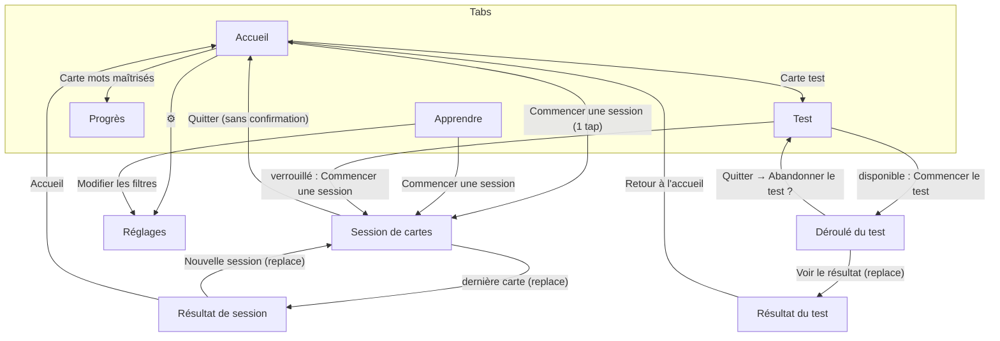

# Design — VocaBoost v2 (direction artistique)

> Rédigé selon `.claude/agents/designer.md`. Entrées : `docs/01-brief-client.md`, `docs/02-spec-pm.md` (**source de vérité** : en cas d'écart, la spec PM prévaut), planche de références du client (captures App Store d'apps de langues). Destinataires : Client (validation), Développeur, QA.
> Maquettes : `docs/design/maquettes.html` (aperçus : `docs/design/apercu-da.png`, `docs/design/apercu-ecrans.png`).
> Mode clair uniquement. Aucune nouvelle dépendance imposée : tout ce qui suit se code avec React Native (`View`, `Text`, `Pressable`, `Animated`) et des emoji. Les options nécessitant une dépendance sont marquées **[P1-dep]** et listées en §9.

## Historique

| Version | Date | Changement | Pourquoi |
|---|---|---|---|
| v1 | 2026-10 | Design fonctionnel : indigo sobre, cartes blanches, ombres légères. Approuvé et implémenté. | Livrer le P0 vite et correctement. |
| **v2** | 2026-10-06 | **Vraie direction artistique** : palette Grape/Sun, boutons « 3D », mascotte Vobi, couleurs par catégorie, célébrations, ton plus chaleureux. Mêmes écrans, mêmes règles, mêmes libellés contractuels. | Demande client : « une vraie DA inspirée des apps du marché (Duolingo et autres) ». La v1 était juste mais générique et peu motivante. |

**Ce qui ne change pas** : flux de navigation (§1 v1 conservé), règles métier, libellés exigés par les critères d'acceptation (§8.4), accessibilité (cibles ≥ 44 pt, AA). **Ce qui change** : tokens visuels, composants (forme, profondeur, animation), hiérarchie de l'Accueil, du Résultat et du Progrès, micro-textes non contractuels.

---

## 1. Analyse de marché (planche client)

Apps observées : Duolingo, Babbel, Memrise, Busuu, Mondly, Rosetta Stone, MosaLingua, Lingvist, Monday/Mondly.

| Code du marché | Exemples | VocaBoost |
|---|---|---|
| Couleurs saturées, gros aplats sur fond clair | Duolingo (vert), Babbel (orange), Busuu (bleu), Memrise (jaune) | ✅ Retenu, avec un duo **violet Grape + jaune Sun** que les concurrents directs n'utilisent pas comme signature |
| Boutons épais « 3D » (lèvre pleine sous le bouton) | Duolingo, Mondly | ✅ Retenu : tous les boutons, options QCM et cartes |
| Mascotte expressive | Hibou Duolingo, perroquet Lingvist… | ✅ Retenu avec un personnage **original** : Vobi, une bulle de parole (pas d'animal) |
| Série de jours / flamme | Duolingo, Busuu | ✅ Retenu : RG-46 existe déjà, on la rend visible (flamme + semaine) |
| Feedback immédiat + bandeau coloré en bas | Duolingo, Babbel | ✅ Retenu pour le test (RG-66 : vert/rouge puis « Suivant ») |
| Célébrations (confettis, écran de fin) | Duolingo, Memrise | ✅ Retenu : fin de session et test réussi |
| Chemin de leçons, XP, ligues, badges | Duolingo, Memrise | ⚠️ Hors spec v1 (« gamification avancée » exclue) → **propositions** §9 uniquement |
| Vies / cœurs qui bloquent | Duolingo | ❌ Rejeté : contraire à « 5-10 min sans frustration » |
| Monnaie virtuelle, boutique, pubs | Duolingo, Mondly | ❌ Rejeté |
| Culpabilisation (« tu vas perdre ta série ! ») | Duolingo | ❌ Rejeté : ton toujours positif |
| Photos de personnes, vidéos | Babbel, Busuu, Memrise | ❌ Hors périmètre (contenu embarqué texte, hors ligne) |

**Interdits de marque** : pas de hibou, pas de vert `#58CC02` (ni proche) comme couleur principale, pas d'orange Babbel, aucun nom/logo/illustration de ces apps.

---

## 2. Direction artistique

### 2.1 Concept
**« Le coach de poche qui transforme 5 minutes par jour en mots anglais qui restent. »**
VocaBoost est un petit booster quotidien : rapide, joyeux, honnête sur les progrès. Le mot est le héros ; la carte qui se retourne est l'objet central (épaisse, tactile).

### 2.2 Personnalité
| Trait | Se traduit par | On évite |
|---|---|---|
| ⚡ Énergique | Couleurs vives, boutons qui « s'enfoncent », micro-rebonds | Animations longues ou en boucle |
| 🤝 Bienveillant | Erreur = « Pas grave », jamais de rouge plein écran, Vobi rassure | Culpabiliser, compter les échecs |
| 🧠 Malin | Explique brièvement (« l'app adapte tes révisions ») | Jargon (« boîte de Leitner » n'apparaît jamais) |
| 🎯 Concret | Chiffres clairs (x / objectif, %), une action principale par écran | Écrans de stats surchargés |

### 2.3 Mascotte : Vobi
**Concept** : une bulle de parole jaune Sun, ronde et pétillante, avec une petite étincelle violette (✦, le « boost ») au-dessus. Vobi « parle anglais à ta place quand les mots te manquent ». Pas d'animal, pas de bec, pas de plumes : aucun risque de confusion avec un concurrent.

**Anatomie (grille 120 × 120, tout en `View`)** :
1. Corps : `View` 100 × 80 en (10, 20), `borderRadius 38`, fond `sun`, lèvre basse 7 pt `sunLip` (`borderBottomWidth: 7`).
2. Queue : carré 24 × 24 `sunLip` en (24, 84), `rotate: '45deg'`, rendu **avant** le corps (derrière).
3. Étincelle : `Text` « ✦ » 26 pt `primary` en (90, 2), `rotate 14deg` (remplacée par l'accessoire quand il est sur la tête).
4. Yeux : ovales 13 × 17 `ink` en x = 38 et 69, y = 44 ; reflet blanc 4,5 pt en (3, 3).
   Variantes : **heureux** « ^^ » (arc : `View` 16 × 10, `borderWidth 4.5`, `borderBottomWidth 0`, `borderTopLeft/RightRadius 12`, fond transparent) ; **fermés** (barre 15 × 4,5) ; **regard haut** (reflet décalé).
5. Sourcils (optionnels) : barres 16 × 4,5, y = 35, `rotate ±16deg` (déterminé : extrémités intérieures basses ; inquiet : inverse).
6. Joues : ellipses 13 × 7 `#FF8FA3` opacité 0,8 en (24, 66) et (83, 66).
7. Bouche (`overflow: 'hidden'`, fond `ink`, langue `flame` en bas) : `smile` 22 × 11 ; `grin` 30 × 17 ; `o` 12 × 14 ovale ; `flat` 16 × 7 ; `sleepy` 10 × 6.
8. Accessoire : un emoji positionné en absolu.

**Expressions** (prop `mood`) :

| mood | Yeux / sourcils / bouche | Accessoire | Où |
|---|---|---|---|
| `hello` | ouverts / — / smile | 👋 à gauche | Accueil, premier lancement |
| `correct` | heureux / — / grin | ✨ | Bandeau « Bonne réponse », Résultat de session |
| `oops` | regard haut / inquiets / o, corps incliné −7° | 💧 | Bandeau « mauvaise réponse » |
| `streak` | ouverts / déterminés / grin | 🔥 sur la tête (remplace ✦) | Carte série, objectif atteint |
| `win` | heureux / — / grin | 🏆 + 🎉 | Résultat du test réussi |
| `retry` | ouverts / déterminés / flat + bandeau `flame` sur le front | 💪 | Résultat du test « À retravailler » |
| `empty` | fermés / — / sleepy, étincelle à 45 % | 💤 | Historique vide, Progrès à 0 |
| `search` | regard haut / — / o | 🔎 | Aucun mot ne correspond aux filtres |

**Plan v1 réaliste** : composant `components/Vobi.tsx` — `<Vobi mood="hello" size={96} />` dessiné sur la grille 120 et mis à l'échelle par `transform: [{ scale: size / 120 }]` dans un conteneur `size × size`. Toujours **décoratif** (`accessible={false}`, `importantForAccessibility="no-hide-descendants"`) : le texte voisin porte le sens. Animation : rebond d'apparition (§6). Tailles d'usage : 36 (indice en session), 56 (bandeaux), 72-96 (Accueil), 120-150 (résultats). *Plus tard* : version SVG/Lottie **[P1-dep]** sans changer le personnage.

### 2.4 Ton rédactionnel
- Tutoiement, phrases courtes (≤ 12 mots), un emoji maximum par phrase, en fin de phrase.
- On célèbre l'effort (« Excellent rythme »), jamais on ne culpabilise (pas de « Échec », « Dommage », « Tu vas perdre »).
- Les erreurs sont normales : « Pas tout à fait… », « Pas grave », « On y retourne ! ».
- Les **libellés contractuels** (§8.4) restent mot pour mot ; on ajoute de la chaleur *autour* (titres, sous-titres, bulle de Vobi), pas à leur place.

| Moment | v1 | v2 |
|---|---|---|
| Accueil, 0 mot vu | « Prêt pour tes 10 premiers mots ? » | Vobi : « Salut ! Prêt pour tes 10 premiers mots ? » |
| Objectif en cours | « Encore {r} cartes pour atteindre ton objectif » | « Plus que {r} cartes ! » (tuile) / Vobi : « Encore {r} cartes et l'objectif du jour est dans la poche 💪 » |
| Série vivante mais pas encore pratiqué aujourd'hui | « 🔥 3 » | « 🔥 3 jours ! Une carte aujourd'hui et la flamme continue. » |
| Fin de session | « Session terminée » | « Session terminée ! » + « Excellent rythme, tes mots s'accrochent. » |
| Mauvaise réponse | « ✗ La bonne réponse était : tomorrow » | Titre « Pas tout à fait… » + « ✗ La bonne réponse était : tomorrow » |
| Test réussi | « Réussi » | Badge « 🏅 Réussi » + Vobi `win` |
| Test raté | « À retravailler » | Badge « À retravailler » + « On y retourne ! Ces mots vont revenir plus souvent. » |
| Historique vide | « Aucun test pour l'instant » | « Aucun test pour l'instant » + « Ton premier score s'affichera ici. » |
| Retour du verso | — | « Sois honnête : l'app adapte tes révisions 😉 » |

---

## 3. Design system v2 (tokens)

Le fichier `src/theme/tokens.ts` garde ses exports (`colors`, `spacing`, `radius`, `typography`, `shadows`, `MIN_TOUCH`, `MAX_FONT_MULTIPLIER`) et **conserve les anciennes clés** (valeurs mises à jour) pour limiter le refactor ; de nouvelles clés et exports (`categoryColors`, `depth`, `motion`) s'ajoutent.

### 3.1 Couleurs

Contrastes WCAG 2.1 calculés (texte normal ≥ 4,5:1 ; éléments graphiques ≥ 3:1).

**Marque**

| Token (nouveau) | Clé héritée | Hex | Usage | Contraste vérifié |
|---|---|---|---|---|
| `primary` | `primary` | `#6B3CF5` | Grape : bouton principal, onglet actif, liens, barre de session, traduction FR | blanc dessus 5,85 ; sur blanc 5,85 |
| `primaryLip` | `primaryPressed` | `#4B22C2` | Lèvre 3D du primaire, état pressé | blanc dessus 9,10 |
| `primarySoft` | `primarySoft` | `#EFE9FF` | Fond chip sélectionnée, bouton 🔊, encart exemple, onglet actif | — |
| `primaryInk` | — | `#3D1A9E` | Texte sur `primarySoft` (badges niveau) | 9,66 sur `primarySoft` |
| `sun` | — | `#FFC83D` | Jaune Sun : Vobi, bouton principal **sur fond Grape**, barre sur fond Grape | `ink` dessus 11,0 |
| `sunLip` | — | `#E0A21A` | Lèvre du bouton Sun, queue/lèvre de Vobi | décoratif |
| `sunSoft` | `warningSoft` | `#FFF4D6` | Carte « Test de la semaine », tuile « mots maîtrisés », état verrouillé | — |
| `sunInk` | `warningText` | `#6B4500` | Texte sur `sunSoft` | 7,74 sur `sunSoft` |
| `flame` | — | `#FF6B4A` | Série : pastilles de jours, bandeau de Vobi `retry`, confettis | décoratif (jamais du texte) |
| `flameSoft` | — | `#FFF0EB` | Fond chip série, jours actifs | — |
| `flameInk` | `warning` | `#B83A1E` | Chiffre de la série, texte sur `flameSoft` | 5,73 sur blanc ; 5,17 sur `flameSoft` |

**Feedback**

| Token | Clé héritée | Hex | Usage | Contraste |
|---|---|---|---|---|
| `success` | `success` | `#0B7F5E` | Bouton « Je savais », « Suivant » après bonne réponse, bordure option correcte | blanc dessus 4,99 |
| `successLip` | `successPressed` | `#075C44` | Lèvre / pressé | — |
| `successBright` | — | `#1FC496` | Remplissage anneau/barres « maîtrisé », confettis (graphique uniquement) | décoratif |
| `successSoft` | `successSoft` | `#E3F8EF` | Fond option correcte, bandeau bonne réponse, tuile score | — |
| `successInk` | `successText` | `#0B6E52` | Texte sur `successSoft` | 5,63 |
| `danger` | `danger` | `#D9364A` | Bordure option incorrecte, bouton danger, texte « ✗ Je ne savais pas » sur blanc | blanc dessus 4,59 ; sur blanc 4,59 |
| `dangerLip` | — | `#A8202F` | Lèvre du bouton danger | — |
| `dangerSoft` | `dangerSoft` | `#FFE8EA` | Fond option incorrecte, bandeau mauvaise réponse | — |
| `dangerInk` | `dangerText` | `#9E1B30` | Texte sur `dangerSoft` | 6,78 |

**Neutres**

| Token | Clé héritée | Hex | Usage | Contraste |
|---|---|---|---|---|
| `bg` | `bg` | `#F7F5FF` | Fond des écrans (lavande très clair) | — |
| `surface` | `surface` | `#FFFFFF` | Cartes, boutons secondaires, barre d'onglets | — |
| `surfaceAlt` | `surfaceAlt` | `#EFEBFA` | Pistes de barres/anneaux, jours inactifs | — |
| `border` | `border` | `#E3DEF5` | Bordure 2 pt + lèvre des cartes/boutons blancs (décoratif) | décoratif |
| `borderStrong` | `borderStrong` | `#8F88AD` | Contour d'élément interactif quand il n'a pas de texte (ex. case cochable) | 3,34 sur blanc |
| `ink` | `text` | `#1E1442` | Texte principal, yeux de Vobi | 17,0 sur blanc ; 15,8 sur `bg` |
| `inkMuted` | `textMuted` | `#5B5577` | Texte secondaire, légendes | 6,98 sur blanc ; 6,46 sur `bg` ; 5,96 sur `surfaceAlt` |
| `textOnColor` | `textOnColor` | `#FFFFFF` | Texte sur primary/success/danger | voir ci-dessus |
| `disabledBg` | `disabledBg` | `#ECE9F5` | Fond bouton désactivé | — |
| `disabledLip` | — | `#D9D4EA` | Lèvre bouton désactivé | — |
| `disabledText` | `disabledText` | `#6E6890` | Texte désactivé | 4,34 (exempté AA : inactif, reste lisible) |
| `overlay` | `overlay` | `rgba(30,20,66,0.55)` | Fond derrière une modale custom | — |
| `cheek` | — | `#FF8FA3` | Joues de Vobi | décoratif |

**Couleurs par catégorie** (`categoryColors`, clé = identifiant de catégorie du code) : `base` = barres, pastilles (≥ 3:1 sur blanc) ; `soft` = fond de carte ; `ink` = texte sur `soft` (≥ 6,9:1).

| Catégorie (RG-04) | Emoji | `base` | `soft` | `ink` | ink/soft | base/blanc |
|---|---|---|---|---|---|---|
| Maison | 🏠 | `#E5620F` | `#FFEEDD` | `#8A3A00` | 6,90 | 3,45 |
| Nourriture | 🍎 | `#E8384F` | `#FFE6EA` | `#8C1426` | 7,92 | 4,11 |
| Voyage | ✈️ | `#1C8CEB` | `#E2F1FF` | `#0A4C87` | 7,62 | 3,50 |
| Travail | 💼 | `#4C5BD4` | `#E7E9FF` | `#28308A` | 9,31 | 5,59 |
| École | 🎒 | `#B97F00` | `#FFF3D1` | `#6E4A00` | 7,19 | 3,44 |
| Corps & santé | 🩺 | `#E0458F` | `#FFE6F2` | `#8A1752` | 7,68 | 3,88 |
| Nature & animaux | 🌿 | `#1E9E57` | `#DFF6E8` | `#0C5B30` | 7,24 | 3,45 |
| Émotions & personnalité | 💜 | `#9B4DE8` | `#F3E8FF` | `#5A1E9A` | 8,53 | 4,54 |
| Temps & calendrier | ⏰ | `#0E9AA7` | `#DDF6F7` | `#065A62` | 7,03 | 3,39 |
| Verbes courants | ⚡ | `#6E9A0E` | `#EEF6D8` | `#3D5A00` | 7,07 | 3,34 |

Règles couleur :
- La couleur n'est **jamais** le seul signal : ✓ / ✗, textes et libellés d'accessibilité accompagnent toujours vert/rouge ; le % est toujours écrit à côté d'une barre.
- Le **niveau** (A1→B2) n'a pas de couleur propre (badge `primarySoft`/`primaryInk`) pour ne pas concurrencer les catégories.
- Le rouge `danger` n'occupe jamais un écran entier : bandeau bas uniquement.

### 3.2 Typographie

**v1 de la v2 : police système** (San Francisco / Roboto), graisses 800-900 pour titres et mots. **Option [P1-dep] : Nunito** (ronde, très lisible, gratuite ; `expo-font` + `@expo-google-fonts/nunito`, poids 600/700/800/900) — c'est la police des maquettes ; à valider par le PM avant installation. Les tailles ci-dessous valent pour les deux.

| Token | Taille / interligne | Poids | Usage |
|---|---|---|---|
| `wordXL` (ex-`display`) | 44 / 52 | 900 | Mot anglais au recto de la Flashcard |
| `score` | 56 / 60 | 900 | Score de fin (« 8 / 10 » si seul, « 16 / 20 ») |
| `wordL` | 38 / 44 | 900 | Mot de la question QCM ; traduction FR au verso (34/40) |
| `h1` | 28 / 34 | 900 | Titre d'écran |
| `h2` | 21 / 27 | 900 | Titre de section, titre de bandeau feedback |
| `h3` | 17 / 22 | 900 | Titre de carte |
| `button` | 17 / 22 | 900 | Libellé de bouton (casse normale, pas de majuscules) |
| `body` | 15 / 22 | 600 | Texte courant, phrase d'exemple (italique) |
| `bodyStrong` | 15 / 22 | 800 | Valeurs inline, options QCM (17/22 800) |
| `caption` | 13 / 18 | 700 | Légendes, « Carte 3 / 10 », dates |
| `overline` | 12 / 16 | 900, `letterSpacing 0.8`, MAJUSCULES | Libellés de rubrique (« OBJECTIF DU JOUR », « TRADUCTION ») |
| `stat` | 30 / 36 | 900 | Valeurs de tuiles |

`allowFontScaling` partout ; `maxFontSizeMultiplier = 1.6` sur `wordXL`, `wordL`, `score`, `stat`. Mot > 14 caractères : `wordXL` → `h1`+ (32/38).

### 3.3 Espacements, rayons, profondeur

**Espacements** (inchangés, base 4) : `xs 4 · sm 8 · md 12 · lg 16 · xl 24 · xxl 32 · xxxl 48`. Marge écran 16 ; entre blocs 14-16 ; padding carte 14-16 ; Flashcard 18-24.

**Rayons (plus généreux)** :

| Token | v1 | v2 | Usage |
|---|---|---|---|
| `sm` | 8 | 10 | Badges, pastille lettre QCM |
| `md` | 12 | 16 | Boutons, chips carrées, encart exemple |
| `lg` | 16 | 22 | Cartes, tuiles, options QCM (18) |
| `xl` | 24 | 30 | Flashcard, bandeau feedback (28 en haut seulement), hero Accueil (26) |
| `pill` | 999 | 999 | Chips de filtre, barres, chip série |

**Profondeur « 3D »** (`depth`) — remplace les ombres floues : une **lèvre pleine** sous l'élément, de la couleur `*Lip` (ou `border` pour les éléments blancs).

| Token | Valeur | Usage |
|---|---|---|
| `depth.sm` | 3 | Chips, bouton icône, bouton 🔊 |
| `depth.md` | 4 | Boutons, options QCM, cartes |
| `depth.lg` | 6 | Flashcard, hero Accueil (5) |

Implémentation RN (sans lib) : conteneur `Pressable` dont le fond = couleur de lèvre et `paddingBottom = depth` ; la face (`View`) a la couleur principale et le même rayon. **Pressé** : la face prend `transform: [{ translateY: depth }]` et le `paddingBottom` passe à 0 (ou on garde le padding et on translate : visuellement la lèvre disparaît). Les éléments blancs ont en plus une bordure 2 pt `border`.
`shadows.md` (ombre floue) n'est conservée que pour les éléments flottants : bandeau feedback, toast.

### 3.4 Iconographie emoji

Un emoji = un sens, partout le même. Décoratifs (`accessible={false}`) dès qu'un texte les accompagne.

| Sens | Emoji | Sens | Emoji |
|---|---|---|---|
| Accueil (onglet) | 🏠 | Série / jour actif | 🔥 |
| Apprendre (onglet) | 📚 | Meilleure série | 🏆 |
| Progrès (onglet) | 📈 | Objectif atteint | 🎯 |
| Test (onglet) | 📝 | Mots vus | 👀 |
| Réglages | ⚙️ | Mots maîtrisés | ✅ (Progrès) / ⭐ (nouveaux maîtrisés en session) |
| Écouter | 🔊 | Test disponible | ✨ |
| Test verrouillé | 🔒 | Test réussi | 🏅 |
| Filtres | 🎛️ | Données locales | 📱 |
| Retourner (indice) | 👆 | Global (Progrès) | 🚀 |
| Catégories | voir §3.1 | Langue de la question | 🇬🇧 Anglais / 🇫🇷 Français |

---

## 4. Composants

Les noms de fichiers actuels (`src/components/*`) sont conservés ; leurs props existantes restent compatibles, les nouveautés sont optionnelles.

### 4.1 Button (3D)
Props v1 + `variant: 'primary' | 'secondary' | 'success' | 'danger' | 'softDanger' | 'sun'` (`tone="success"` reste accepté = `success`), `size: 'sm' (44) | 'md' (48) | 'lg' (56)`.

| Variante | Face | Lèvre | Texte | Bordure | Usage |
|---|---|---|---|---|---|
| primary | `primary` | `primaryLip` | blanc | — | Action principale |
| sun | `sun` | `sunLip` | `ink` | — | Action principale **posée sur un fond Grape** (hero Accueil) |
| secondary | `surface` | `border` | `primary` | 2 `border` | Action secondaire (« Accueil », « Passer le test ») |
| success | `success` | `successLip` | blanc | — | « ✓ Je savais », « Suivant » après bonne réponse |
| softDanger | `surface` | `border` | `danger` | 2 `border` | « ✗ Je ne savais pas » (pas de rouge plein pour ne pas punir) |
| danger | `danger` | `dangerLip` | blanc | — | « Suivant » après erreur, « Réinitialiser ma progression » |
| désactivé | `disabledBg` | `disabledLip` | `disabledText` | — | Aucun retour au toucher |

Rayon 16 (14 en `md`/`sm`), pleine largeur par défaut pour les actions d'écran. Pressé : translateY = 4 en 60 ms, relâché : retour ressort 120 ms (§6). `loading`, anti-double-tap et accessibilité inchangés (v1).

### 4.2 Card
Fond `surface`, rayon 22, bordure 2 `border`, lèvre 4 `border`. Variantes de ton : `tone?: 'default' | 'sun' | 'success' | 'primary'` (fond `sunSoft` + bordure/lèvre `#F5DE9C` ; `successSoft` ; `primary` plein avec texte blanc pour les « hero »). Pressable : la face s'enfonce de 2 pt.

### 4.3 Flashcard
Mêmes props et comportements que v1 (retournement **à sens unique**, annonces, TTS P2). Nouveau look :
- Carte `surface`, rayon 30, bordure 2 `border`, lèvre 6 `border`, `flex: 1` (occupe l'espace entre header et actions).
- En haut : chip catégorie (fond `categoryColors[c].soft`, texte `ink` de la catégorie, emoji + nom, rayon 12) à gauche ; badge niveau à droite ; dessous `caption` « Carte {n} / {N} ».
- **Recto** : mot EN `wordXL` centré ; bouton 🔊 rond 56 (`primarySoft`, lèvre 4 `#D9CCFF`) dessous (P2) ; en bas « 👆 Touche la carte pour la retourner » (`caption` 800 `inkMuted`).
- **Verso** (bloc centré verticalement) : mot EN 30/36 900 + 🔊 44 ; séparateur pointillé 2 pt `border` ; `overline` « TRADUCTION » + traduction FR 34/40 900 `primary` ; `overline` « EXEMPLE » + encart `primarySoft` rayon 18 : phrase en italique `body` 16/23 + 🔊 phrase (fond blanc).

### 4.4 ProgressBar
Hauteur 16 (session/test) ou 10 (listes). Piste `surfaceAlt` (ou `rgba(255,255,255,0.25)` sur fond Grape), remplissage `primary` | `successBright` | `sun` | couleur de catégorie, rayon pill. Reflet : bande 4 pt `rgba(255,255,255,0.35)` à 4 pt du haut, inset 8 (hauteur 16 seulement). Valeur minimale visible 6 % de largeur si > 0. Accessibilité v1 inchangée.

### 4.5 ProgressRing (nouveau, sans SVG)
Props : `value` (0-1, borné), `size` (64 par défaut), `thickness` (9), `color` (`primary` ; `successBright` si atteint), `children` (texte central), `accessibilityLabel`.
Technique « deux demi-disques » en `View` : cercle piste `surfaceAlt` ; deux moitiés masquées (`overflow: 'hidden'`, largeur `size/2`) contenant chacune un demi-disque coloré tourné de `min(value, 0.5) × 360°` puis `max(value − 0.5, 0) × 360°` ; disque blanc central de `size − 2 × thickness`. Valeur ≥ 1 → anneau plein + `successBright`. `accessibilityRole="progressbar"`. *Si `react-native-svg` est validé [P1-dep], remplacer par un `Circle` + `strokeDasharray`.*
Usage : objectif du jour (Accueil, Résultat de session). Centre : « {x} » `h3` 900 + « / {objectif} » `caption`.

### 4.6 StreakChip et WeekStrip (nouveaux)
- **StreakChip** (header Accueil) : pill 40, fond `flameSoft`, bordure 2 `#FFD9CC`, « 🔥 {série} » `h3` `flameInk`. État **éteint** (série = 0) : fond `surfaceAlt`, flamme en niveaux de gris (opacité 0,6), chiffre `inkMuted`. `accessibilityLabel="Série actuelle : {n} jour(s)"`.
- **WeekStrip** : 7 pastilles L M M J V S D de la **semaine ISO courante** (lundi → dimanche) ; jour actif (RG-45, déjà stocké RG-48) = pastille `flame` (Accueil, 16 pt) ou cercle `flameSoft` + bordure `flame` + 🔥 (Progrès, 28 pt) ; aujourd'hui = contour pointillé ; jour futur/inactif = `surfaceAlt`. Pur affichage, aucune règle nouvelle. Label : « Cette semaine : {k} jours actifs ».

### 4.7 StatTile
Fond coloré doux (`successSoft`, `sunSoft`, `primarySoft`) ou blanc, rayon 20, sans bordure quand colorée. Valeur `stat` dans l'`ink` correspondant (`successInk`, `sunInk`…), légende `caption` même couleur. Props v1 + `tone: 'default' | 'success' | 'sun' | 'flame' | 'primary'`.

### 4.8 CategoryCard (nouveau, Progrès)
Fond `soft`, rayon 20, padding 12. Ligne 1 : pastille emoji blanche 34 (rayon 12) + nom (`h3` 14/17, `ink` catégorie, `flex: 1`, retour à la ligne autorisé) + « {pct} % » (19/24 900, `nowrap`). Ligne 2 : barre 10 (piste blanche, remplissage `base`, valeur maîtrisés/20). Lignes 3-4 : `caption` 12/16 800 « {vus}/20 vus » et « {maîtrisés}/20 maîtrisés ». Grille 2 colonnes, gap 10 ; 1 colonne si police agrandie (> 1,3). Label v1 inchangé.

### 4.9 Chip de filtre
Hauteur 44, pill, bordure 2, lèvre 3. Non sélectionnée : `surface` / `border` / texte `ink`. Sélectionnée : `primarySoft` / bordure + lèvre `primary` / texte `primaryInk`, préfixe « ✓ ». Catégories : emoji de la catégorie avant le nom (« ✓ ✈️ Voyage »). Règle RG-50 et texte d'aide inchangés.

### 4.10 OptionButton (QCM)
Min 60, rayon 18, bordure 2, lèvre 4. Pastille lettre 32 × 32 (A, B, C, D) rayon 10 à gauche ; libellé 17/22 800.

| État | Fond | Bordure + lèvre | Texte | Pastille | Marqueur |
|---|---|---|---|---|---|
| idle | `surface` | `border` | `ink` | contour `border`, lettre `inkMuted` | — |
| pressé | `primarySoft` | `primary` | `ink` | — | face enfoncée |
| correct | `successSoft` | `success` | `successInk` | pleine `success`, lettre blanche | « ✓ » |
| incorrect | `dangerSoft` | `danger` | `dangerInk` | pleine `danger`, lettre blanche | « ✗ » |
| disabled | `surface` | `border`, lèvre 2 | `inkMuted`, opacité 0,75 | contour | — |

Règles et libellés d'accessibilité v1 inchangés (la lettre n'est pas lue : label « Option {i} : {label} »).

### 4.11 FeedbackSheet (nouveau, test)
Bandeau fixé en bas (remplace la zone de 76 pt v1), rayon 28 en haut, padding 16/18 + inset bas. Glisse depuis le bas (§6).
- Bonne réponse : fond `successSoft` ; Vobi `correct` 56 ; titre `h2` `successInk` « ✓ Bonne réponse ! » ; sous-titre `caption` « {mot EN} = {mot FR} » ; bouton `success` « Suivant » / « Voir le résultat ».
- Mauvaise réponse : fond `dangerSoft` ; Vobi `oops` 56 ; titre `h2` `dangerInk` « Pas tout à fait… » ; ligne `bodyStrong` `dangerInk` « ✗ La bonne réponse était : {réponse} » ; bouton `danger` « Suivant » / « Voir le résultat ».
Annonce lecteur d'écran v1 inchangée (la phrase « ✓ Bonne réponse ! » / « La bonne réponse était : … »).

### 4.12 Confetti (nouveau)
`components/Confetti.tsx` : 24 `Animated.View` (rectangles 10 × 16 rayon 3 et ronds 11), couleurs tirées de `primary`, `sun`, `flame`, `successBright`, `#1C8CEB`, `#E0458F`. Positions x aléatoires, départ y −20, chute jusqu'à 45 % de la hauteur, rotation 1-3 tours, durée 1 400-1 800 ms, `Easing.out(Easing.quad)`, fondu sur les 300 dernières ms, une seule fois, `useNativeDriver: true`, `pointerEvents="none"`, derrière le contenu. **Réduire les animations** : 10 confettis immobiles déjà posés (aucun mouvement). Non lu par les lecteurs d'écran. *Corrigé après recette (V2-02)* : le calque occupe la zone de Vobi (pleine largeur, hauteur de Vobi) et laisse libre une colonne centrale de la largeur de Vobi + 24 ; les confettis tombent de part et d'autre de Vobi, jamais derrière le titre ni le score, animés comme immobiles.

### 4.13 Autres
- **Badge** : rayon 10, `caption` 900, padding 4/10 ; variantes `level` (`primarySoft`/`primaryInk`), `success` (« Réussi »), `danger` (« À retravailler »), `big` (16 pt, padding 8/14).
- **EmptyState** : Vobi (`empty` ou `search`, 96) à la place de l'emoji 48 ; titre `h3`, message `body` `inkMuted`, action selon v1.
- **SegmentedControl** (objectif 10/15/20/30 depuis la v1.2) : piste `surfaceAlt` rayon 16 ; segment actif = face `primary` + lèvre `primaryLip`, texte blanc 900 ; inactif texte `ink`.
- **IconButton** (⚙️) : 44 × 44, rayon 14, blanc, bordure + lèvre `border`.
- **ConfirmDialog** : `Alert.alert` natif (inchangé).
- **Toast** : pill `ink` texte blanc, ou `successSoft`/`successInk` « Progression réinitialisée », `shadows.md`.

---

## 5. Écrans

Conventions v1 conservées (pluriels, chargement neutre avant réhydratation, recalcul au focus). Les maquettes `docs/design/maquettes.html` font foi pour les proportions.

### 5.0 Barre d'onglets
Fond `surface`, bordure haute 2 `border`. Onglets 🏠 Accueil · 📚 Apprendre · 📈 Progrès · 📝 Test. Actif : pastille `primarySoft` rayon 16 derrière emoji + libellé, texte `primary` 800 ; inactif : `inkMuted`, emoji opacité 0,75. Pastille `flame` 9 pt (contour blanc 2) sur 📝 quand le test est **disponible**. À l'appui : emoji rebond 1 → 1,15 → 1 (180 ms).

### 5.1 Accueil
**But** : 1 tap pour lancer (AC-01.1), l'essentiel d'un coup d'œil (AC-04.1).
1. **En-tête** (48) : logotype texte « voca**boost** » (`ink` + `primary`, 24/900) ; à droite StreakChip + IconButton ⚙️ (« Réglages »).
2. **Hero** (Card `primary`, rayon 26, lèvre 5 `primaryLip`) : Vobi 94 `hello` (ou `streak` si objectif atteint) + bulle blanche (rayon 18, coin bas-gauche 6) contenant le message du jour ; bouton **sun** `lg` « **Commencer une session** » pleine largeur ; si filtre actif (RG-53) : ligne `caption` blanche « 🎛️ Filtres : {résumé} » + lien souligné « Modifier » (→ Réglages).
   Message de Vobi (priorité décroissante) :
   - 0 mot vu : « Salut ! Prêt pour tes 10 premiers mots ? »
   - objectif atteint : « Objectif atteint ✅ Chaque carte en plus compte ! »
   - aucune carte aujourd'hui et série > 0 : « 🔥 {s} jours ! Une carte aujourd'hui et la flamme continue. »
   - sinon : « Encore {r} cartes et l'objectif du jour est dans la poche 💪 »
3. **Deux tuiles** (gap 12) :
   - « OBJECTIF DU JOUR » : ProgressRing 64 « {x} / {objectif} » + texte « Plus que **{r} cartes** ! » ou « Objectif atteint ✅ » (`successInk`). Dépassement : « 15 / 10 », anneau plein.
   - « SÉRIE » : 🔥 30 + « {s} » 30/900 `flameInk` + « jours de suite » / « jour de suite » ; WeekStrip compacte (pastilles 16). Série 0 : flamme grise, « 0 jour », texte « Lance ta série aujourd'hui ».
4. **Carte « mots maîtrisés »** (pressable → Progrès) : pastille 🎯 `successSoft` 44 ; « {pct} % maîtrisés » `h3` ; « {maîtrisés} / 200 » `caption` ; barre 10 `successBright` ; chevron « › ».
5. **Carte « Test de la semaine »** (pressable → onglet Test), selon état :
   - verrouillé : Card `default`, « 🔒 Étudie encore {X} mots pour débloquer le test de la semaine » + barre `sun` vus/10 ;
   - disponible : Card `sun`, « ✨ Ton test de la semaine est disponible », `caption` `sunInk` « {N} questions · pas de chrono · 1 essai », Button `secondary` `sm` pleine largeur « Passer le test » ;
   - terminé : Card `default`, « ✅ Test de la semaine terminé : {x}/{N} » + Badge Réussi/À retravailler + `caption` « Prochain test disponible lundi ».
Le bouton principal reste visible sans scroll sur 667 pt (le hero est au-dessus de la ligne de flottaison).

### 5.2 Apprendre
1. Titre `h1` « Apprendre » + Vobi 56 `hello` à droite.
2. Card `primary` « Ta prochaine session » : « 10 cartes tirées au hasard, en priorité les mots que tu ne maîtrises pas encore. » (blanc) ; `caption` « Mots disponibles avec tes filtres : {k} » ; si k < 10 : « Ta session contiendra {k} cartes. »
3. Card « Filtres » : rangée de 10 pastilles catégorie (emoji sur `soft`, opacité 0,35 + niveaux de gris si non sélectionnée) + « Niveaux : {Tous | liste} » ; Button `secondary` `md` « Modifier les filtres » (→ Réglages).
4. Card « Comment ça marche » : trois étapes numérotées dans des pastilles `primarySoft` (texte v1 inchangé).
5. Bouton `primary` `lg` fixé en bas « Commencer une session ».
État pool vide : EmptyState Vobi `search` « Aucun mot ne correspond à tes filtres » + « Réinitialiser les filtres » ; bouton principal désactivé.

### 5.3 Session de cartes
1. **Header** (52) : « ✕ Quitter » (texte `primary` 900, 44 pt) ; ProgressBar 16 `primary` (n−1)/N ; compteur « {n}/{N} » `caption` 900.
2. **Flashcard** (§4.3) avec marge 16.
3. **Zone d'actions** (min 120, padding bas 34 + inset) :
   - avant retournement : indice discret (Vobi 36 + « Tu le connais ? Pense à la traduction… », `caption` `ink`) puis Button `primary` « Retourner » ;
   - après retournement : `caption` centrée « Sois honnête : l'app adapte tes révisions 😉 » puis deux boutons égaux (gap 12) : gauche `softDanger` « ✗ Je ne savais pas », droite `success` « ✓ Je savais ». Ordre de lecture v1 conservé (« Je savais » d'abord).
Comportements, état vide (EmptyState Vobi `search`), Quitter sans confirmation : inchangés v1. Après « Je savais » : la barre avance avec un petit éclat (§6) ; après « Je ne savais pas » : aucune animation négative.

### 5.4 Résultat de session
Confettis (§4.12) si ≥ 50 % de « Je savais » ; sinon pas de confettis et Vobi `hello` « Bel effort ! ».
Bloc centré verticalement :
1. Vobi 150 `correct` (rebond d'entrée).
2. `h1` « Session terminée ! » + `body` `inkMuted` « Excellent rythme, tes mots s'accrochent. » (< 50 % : « Chaque carte te rapproche du but. »).
3. Deux StatTile : `success` « {connus} / {N} » + « mots que tu savais » ; `sun` « ⭐ {m} » + « nouveaux mots maîtrisés » (m = 0 → tuile blanche, « 0 »).
4. Card objectif : ProgressRing 64 « {x} / {objectif} » + titre « Objectif du jour atteint 🎯 » (`successInk`) ou « Encore {r} cartes pour atteindre ton objectif » ; sous-titre « Série : 🔥 {s} jours de suite ».
5. Actions en bas : `primary` « Nouvelle session » ; `secondary` « Accueil ».
Les chiffres « {connus} » et « {x} » comptent de 0 à la valeur en 600 ms (§6).

### 5.5 Progrès
1. `h1` « Progrès ».
2. **Hero** Card `primary` : « {pct} % » 44/900 blanc + « de la banque maîtrisée » ; 🚀 à droite ; barre 16 `sun` sur piste blanche 25 % ; deux mini-tuiles translucides (`rgba(255,255,255,0.10)`, soit ≈ 4,9:1 pour le texte blanc — corrigé après recette V2-04) : « 👀 {vus} / 200 · Mots vus » et « ✅ {maîtrisés} / 200 · Mots maîtrisés ».
3. **Card série** : « 🔥 {s} jours · Série actuelle » (`flameInk`) et « 🏆 {b} jours · Meilleure série » ; WeekStrip 28 pt en dessous.
4. `h2` « Par catégorie » puis grille 2 colonnes de CategoryCard dans l'ordre RG-04.
5. `caption` : « Un mot est maîtrisé quand tu l'as su plusieurs fois de suite. »
État vide : au-dessus des catégories, EmptyState compact Vobi `empty` « Ta progression apparaîtra ici » / « Fais ta première session pour commencer. » / `primary` « Commencer une session » ; catégories visibles à 0 %.

### 5.6 Test (onglet)
1. `h1` « Test de la semaine » + `overline` « Semaine {ww} – {yyyy} ».
2. Card d'état :
   - **Verrouillé** : Card `sun` ; « 🔒 Étudie encore {X} mots pour débloquer le test de la semaine » (`sunInk`) ; barre `sun` vus/10 ; `primary` « Commencer une session ».
   - **Disponible** : Card blanche avec Vobi 72 `hello` ; « ✨ Ton test est prêt » `h3` ; « {N} questions à choix multiples sur les mots que tu as étudiés. Pas de limite de temps. » ; `caption` « Réussi à partir de 70 %. Un seul essai par semaine. » ; `primary` « Commencer le test ».
   - **Terminé** : « ✅ Test de la semaine terminé : {x}/{N} » + Badge ; `caption` « Prochain test disponible lundi ».
3. `h2` « Historique » : lignes Card compactes : pastille ronde 40 (🏅 `successSoft` si réussi / 📖 `dangerSoft` sinon) ; « Semaine {ww} – {yyyy} » `bodyStrong` + date `caption` ; à droite « {x}/{N} · {pct} % » + Badge. Plus récent en premier.
État vide : EmptyState Vobi `empty` « Aucun test pour l'instant » + « Ton premier score s'affichera ici. » (sans bouton).

### 5.7 Déroulé du test
1. Header identique à la session : « ✕ Quitter » · barre (i−1)/N · « {i}/{N} ».
2. Ligne consigne : impaire « Quelle est la traduction de ce mot ? » + badge « EN → FR » ; paire « Comment dit-on ce mot en anglais ? » + badge « FR → EN ».
3. Card mot (rayon 26, padding 26) : `overline` « 🇬🇧 Anglais » / « 🇫🇷 Français » + mot `wordL` centré.
4. 4 OptionButton (gap 12).
5. FeedbackSheet (§4.11) après réponse uniquement.
Comportements v1 inchangés : feedback instantané, pas d'avancement automatique, pas de retour, « Quitter » avec confirmation « Abandonner le test ? » (« Continuer le test » / « Abandonner »).

### 5.8 Résultat du test
1. Confettis + Vobi 120 `win` si réussi ; Vobi 120 `retry` sans confettis sinon.
2. `overline` « Semaine {ww} – {yyyy} » + `h1` « Résultat du test ».
3. Ligne score : « {x} / {N} » `score` + colonne « {pct} % » (22/900, `successInk` ou `dangerInk`) et Badge `big` « 🏅 Réussi » ou « À retravailler ».
4. `caption` « Seuil de réussite : 70 % ».
5. Card « Mots à revoir ({k}) » : lignes « [pastille catégorie] **{en}** — {fr} », séparateurs pointillés ; k = 0 : Vobi `correct` 56 + « Aucune erreur, bravo ! 🎉 ».
6. `caption` « Ces mots reviendront plus souvent dans tes sessions. » (si raté, précédé de « On y retourne ! »). Aucun mot à revoir (k = 0) : « Continue tes sessions pour garder ce niveau. » à la place (recette V2-06).
7. `primary` fixé en bas « Retour à l'accueil ».

### 5.9 Réglages
Structure v1 inchangée, habillage v2 :
1. Section « Objectif quotidien » : SegmentedControl 3D 10 / 15 / 20 / 30 (v1.2) + `caption`.
2. Section « Filtres des sessions » : chips niveaux ; chips catégories avec emoji ; lien « Tout sélectionner » ; aide RG-50 ; « Mots disponibles : {k} ».
3. Section « Données » : Card `default` « 📱 Données stockées uniquement sur cet appareil. » + Button `danger` `md` « Réinitialiser ma progression » ; confirmation `Alert` v1 (« Cette action est irréversible… », « Annuler » / « Réinitialiser ») ; toast « Progression réinitialisée ».
4. Pied : Vobi 36 + « VocaBoost v1.0 » `caption`.

---

## 6. Animations et feedback

Bibliothèque : `Animated` de React Native (ou `react-native-reanimated`, **déjà installé**). `useNativeDriver: true` partout (transform/opacity). Toute animation est déclenchée par un événement : **aucune boucle infinie**.

| Élément | Animation | Durée | Easing | Si « Réduire les animations » |
|---|---|---|---|---|
| Appui bouton/option/carte | face translateY 0 → depth | 60 ms enfoncé ; 120 ms retour | `Easing.out(quad)` / ressort (friction 6) | Changement instantané (sans transition) |
| Flashcard retournement | rotateY 0 → 180° (2 faces, `backfaceVisibility`) + scale 1 → 1,03 → 1 | 320 ms | `Easing.inOut(cubic)` | Fondu enchaîné 150 ms |
| Carte suivante | sortie translateX −40 + opacité 0 ; entrée scale 0,96 → 1 + opacité | 200 ms + 180 ms | `out(quad)` | Fondu 150 ms |
| Barre de progression | largeur vers la nouvelle valeur ; après « Je savais » : reflet qui traverse | 300 ms | `out(cubic)` | Saut direct |
| Option correcte | pop scale 1 → 1,04 → 1 | 180 ms | ressort | Aucune |
| Option incorrecte | secousse translateX 0, −6, 6, −4, 4, 0 | 300 ms | linéaire | Aucune |
| FeedbackSheet | translateY 100 % → 0 | 220 ms | `out(back(1.2))` | Fondu 150 ms |
| Vobi entrée (résultats, bandeaux) | scale 0,6 → 1,08 → 1 + rotate −6° → 0 | 400 ms | ressort | Affiché directement |
| Compteurs de score | 0 → valeur | 600 ms | `out(cubic)` | Valeur finale directe |
| ProgressRing objectif atteint | rotation du remplissage + 🎯 pop | 500 ms | `out(cubic)` | Direct |
| Confettis | §4.12 | 1 400-1 800 ms, une fois | `out(quad)` | 10 confettis immobiles |
| Onglet sélectionné | emoji scale 1 → 1,15 → 1 | 180 ms | ressort | Aucune |

Règles :
- L'enregistrement (RG-14, RG-69) se fait **au tap, avant** l'animation ; aucune action n'attend la fin d'une animation de plus de 200 ms (les boutons d'évaluation sont actifs dès que la face verso est visible ; cf. point connu RT-02 à garder ≤ 300 ms).
- Lecture de `AccessibilityInfo.isReduceMotionEnabled()` au montage + écoute `reduceMotionChanged` ; un hook `useReducedMotion()` partagé.
- Vibration légère (`Vibration.vibrate(10)`, API native déjà utilisée) sur « Je savais » et sur bonne réponse ; jamais sur une erreur. Sons : non (proposition §9).

---

## 7. Accessibilité (conservée et renforcée)

- Cibles ≥ 44 × 44 pt (boutons 44-56, options ≥ 60, chips 44, 🔊 44-56 ; `hitSlop` pour « Modifier ») ; ≥ 8 pt entre cibles.
- Contrastes : tous les couples texte/fond du §3.1 sont ≥ 4,5:1 (texte blanc sur `primary` 5,85, `success` 4,99, `danger` 4,59) ; `flame`, `successBright`, `sun` ne portent **jamais** de texte blanc ni de texte fin.
- Couleur jamais seule (✓/✗, libellés, %).
- Vobi, confettis, emoji décoratifs : `accessible={false}` ; les messages de Vobi sont du texte réel lisible par le lecteur d'écran (bulle = `Text`).
- Profondeur 3D : purement visuelle, l'état pressé ne transmet aucune information.
- Texte dynamique : grilles 2 colonnes → 1 colonne au-delà d'un facteur 1,3 ; `minHeight` plutôt que `height` (sauf pastilles décoratives).
- Annonces lecteur d'écran, `accessibilityLanguage="en-US"` sur les mots anglais, labels v1 : inchangés.
- Réduction des animations : §6.

---

## 8. Directives UX

### 8.1 Flux d'écrans
Inchangés par rapport à la v1 (arborescence expo-router, diagramme, règles de navigation, confirmations) :



### 8.2 Confirmations
| Action | Confirmation |
|---|---|
| Quitter une session | Non (rien n'est perdu, RG-14/34) |
| Quitter / retour pendant un test | Oui : « Abandonner le test ? » |
| Réinitialiser ma progression | Oui : « Réinitialiser ma progression ? » |
| Changer objectif / filtres | Non |

### 8.3 Cas limites (v1 conservés + visuels v2)
| Cas | Comportement |
|---|---|
| Pool filtré vide | EmptyState Vobi `search` « Aucun mot ne correspond à tes filtres » + « Réinitialiser les filtres » |
| Objectif dépassé | « 15 / 10 », anneau plein `successBright`, « Objectif atteint ✅ » |
| Série 0 | StreakChip éteinte (flamme grise) ; jamais de message culpabilisant |
| Série vivante, pas encore pratiqué aujourd'hui (RG-46 cas « hier ») | Flamme allumée, message Vobi « Une carte aujourd'hui et la flamme continue » |
| Session < 50 % « Je savais » | Pas de confettis, Vobi `hello`, « Chaque carte te rapproche du but. » |
| Test raté | Pas de confettis, Vobi `retry`, ton encourageant |
| Mot / traduction long | `wordXL` → 32/38 au-delà de 14 caractères ; retour à la ligne |
| Petit écran (≤ 640 pt) | Contenu scrollable ; actions fixées en bas ; hero Accueil : Vobi 72 |
| Police très agrandie | Grilles en 1 colonne ; les deux boutons d'évaluation passent l'un sous l'autre (« Je savais » en premier) |
| Reste des cas v1 (minuit, lundi, fermeture, double tap, TTS, corruption) | Inchangés |

### 8.4 Libellés contractuels (inchangés, ne pas reformuler)
« Commencer une session » · « Retourner » · « Je savais » · « Je ne savais pas » · « Quitter » · « Session terminée » (le « ! » est ajouté) · « Nouvelle session » · « Accueil » · « Commencer le test » · « Passer le test » · « Suivant » · « Voir le résultat » · « Abandonner le test ? » · « Continuer le test » · « Abandonner » · « Réussi » · « À retravailler » · « Retour à l'accueil » · « Historique » · « Aucun test pour l'instant » · « Étudie encore {X} mots pour débloquer le test de la semaine » · « Test de la semaine terminé : {x}/{N} » · « Prochain test disponible lundi » · « Aucun mot ne correspond à tes filtres » · « Réinitialiser les filtres » · « Réinitialiser ma progression » · « Cette action est irréversible » · « Annuler » · « Réinitialiser » · « Données stockées uniquement sur cet appareil » · « ✓ Bonne réponse ! » · « La bonne réponse était : {réponse} » · « Objectif atteint ✅ » · « Semaine {ww} – {yyyy} ».

Note pour le Développeur/QA : les `testID` existants sont conservés ; les tests qui cherchent « Session terminée » doivent accepter « Session terminée ! » (recherche par regex ou `testID`).

### 8.5 Ordre d'implémentation conseillé
1. Tokens v2 (`tokens.ts` : couleurs, `categoryColors`, `depth`, `motion`, typographie) — aucun écran ne casse grâce aux clés héritées.
2. Button 3D, Card, OptionButton, Chip, ProgressBar (composants existants).
3. Nouveaux composants : Vobi, ProgressRing, StreakChip/WeekStrip, CategoryCard, FeedbackSheet, Confetti, hook `useReducedMotion`.
4. Écrans dans l'ordre : Session → Test → Résultats → Accueil → Progrès → Apprendre/Test/Réglages.
5. Passage QA visuel contre `docs/design/maquettes.html`.

---

## 9. Propositions hors spec (à valider par le PM / client — NON incluses dans la v2)

| # | Proposition | Impact | Statut spec |
|---|---|---|---|
| P-01 | **XP** : +10 XP par carte « Je savais », +5 par carte évaluée, +50 pour un test réussi ; affiché dans le header | Nouvelle donnée persistée + règles | Contredit « gamification avancée (XP) hors périmètre » → décision client requise |
| P-02 | **Niveaux d'apprenant** (« Explorateur → Bilingue ») basés sur les mots maîtrisés (paliers 25/50/100/150/200) | Calcul pur sur RG-41, pas de nouvelle donnée | Nouvelle mécanique |
| P-03 | **Badges** (1re session, série de 7 jours, catégorie maîtrisée 20/20, test 100 %) avec écran « Trophées » | Persistance des badges obtenus | Hors périmètre v1 (badges exclus) |
| P-04 | **Combo intra-session** (« 3 d'affilée ! ✨ » après 3 « Je savais » consécutifs) | Affichage uniquement | Nouvelle mécanique (sans effet métier) |
| P-05 | **Gel de série** (1 jour manqué toléré par semaine) | Modifie RG-46 | Changement de règle métier |
| P-06 | **Chemin des catégories** (parcours visuel façon « carte » à la place de la grille Progrès) | UI seulement | Nouvelle présentation |
| P-07 | **Police Nunito** | `expo-font` + `@expo-google-fonts/nunito` | Nouvelle dépendance [P1-dep] |
| P-08 | **`react-native-svg`** pour Vobi vectoriel et l'anneau d'objectif | Dépendance Expo officielle | [P1-dep] |
| P-09 | **Sons de feedback** (ding / plop, coupés par le mode silencieux) | `expo-audio` + fichiers audio | [P1-dep], P2 |
| P-10 | **Retour haptique riche** (`expo-haptics`) au lieu de `Vibration` | Dépendance Expo officielle | [P1-dep] |
| P-11 | **Mode sombre** dérivé de la palette (fond `#140D2E`) | Thème complet | Hors périmètre v1 |
| P-12 | **Icône d'app et splash** avec Vobi sur fond Grape | Assets uniquement | À produire après validation de la DA |

---

## 10. Points à remonter au PM

1. Aucune règle métier n'est modifiée ; WeekStrip et message « série vivante » exploitent les données existantes (RG-45/46/48).
2. La police v2 par défaut est la police système ; Nunito (P-07) est souhaitable pour la cohérence avec les maquettes.
3. « Session terminée ! » ajoute un point d'exclamation au libellé v1 (impact tests : §8.4).
4. Valider la liste §9 (en particulier P-01/P-03, explicitement hors périmètre v1).

## Validation
- v1 : ✅ approuvée (PM/Client), implémentée.
- **v2 : en attente de validation client** sur la base de `docs/design/maquettes.html`. L'implémentation ne commence qu'après validation.

## Validation Client — v2
✅ Direction artistique v2 **approuvée** par le client (maquettes `docs/design/`). Aucune des propositions hors spec n'est retenue pour l'instant (XP/niveaux/badges, combo, gel de série, mode sombre, icône/splash Vobi, Nunito, sons/haptique) : implémentation v2 sans nouvelle dépendance.


---

# v1.1 — Revoir le vocabulaire du jour

> Ajouté le 2026-10-07. Source de vérité fonctionnelle : `docs/02-spec-pm.md` §10 à §15 (RG-100 → RG-134, US-11 → US-16, décisions D-01 → D-08 approuvées par le client). Rien ci-dessus n'est modifié : cette section **réutilise** la DA v2 (Vobi, palette Grape/Sun/Flame et couleurs de catégorie, boutons 3D, Flashcard) et ajoute au minimum de nouveau.
> Maquettes : `docs/design/maquettes-revision.html` (aperçu : `docs/design/apercu-revision.png`). Mode clair, aucune dépendance, aucune écriture dans le store.
> Notation : ` ` dans ce chapitre = espace insécable (U+00A0), à mettre dans les chaînes avant `!` `?` `:` `;` (ex. « Mots du jour : 3 »). Les libellés contractuels sont **sans** variante : « Retenu », « À revoir encore », « Réviser ces mots », etc.

## v1.1.1 Principes

1. **Lecture seule, et on le dit.** Réviser ne touche ni les boîtes, ni l'objectif, ni la série. L'écran le dit en une phrase courte et positive (§v1.1.7), jamais en jargon (« boîte », « Leitner » n'apparaissent jamais).
2. **Pas un test.** Les libellés « Retenu / À revoir encore » et le verbe « Réviser » se distinguent de « Je savais / Je ne savais pas » (session). Pas de confettis, pas de ✗, pas de rouge : « À revoir encore » est un **rappel**, pas une erreur (bouton `secondary`, badge `sun`).
3. **Réutiliser.** Flashcard, Button, Card, Badge, EmptyState, ProgressBar, Vobi, chips de catégorie sont repris tels quels ; 1 nouveau composant de ligne, 1 note d'info, 2 variantes (Badge, Button).
4. **Indicateur d'état jamais en couleur seule** : glyphe + mot (« ✓ Su » / « ↻ À revoir »).

## v1.1.2 Parcours et flux d'écrans

Nouvelles routes proposées (hors onglets, pile au-dessus des onglets, donc sans barre d'onglets, comme `session`) : `/review` (liste), `/review-run` (passe), `/review-result` (fin de passe). Nommage final au Développeur.

```mermaid
flowchart TD
  H[Accueil\ncarte « Mots du jour : n » si n ≥ 1] -- "Revoir" --> LST[Mots du jour\nliste]
  A[Apprendre\nentrée « Mots du jour (n) »] -- "tap (toujours présente)" --> LST
  SR[Résultat de session\nlien « Revoir les mots du jour »] -- "push" --> LST
  LST -- "n = 0" --> EMP[État vide]
  EMP -- "Commencer une session" --> S[Session de cartes]
  LST -- "Réviser ces mots (instantané des ids)" --> RUN[Passe de révision\ncartes]
  RUN -- "Quitter (sans confirmation)" --> LST
  RUN -- "dernière carte (replace)" --> END[Fin de passe]
  END -- "Refaire les mots difficiles (si ≥ 1)" --> RUN2[Passe « mots difficiles »]
  END -- "Refaire tous les mots" --> RUN
  RUN2 -- "Quitter" --> LST
  RUN2 -- "dernière carte (replace)" --> END
  END -- "Accueil" --> H
  LST -- "‹ Retour" --> BACK[écran précédent\nAccueil / Apprendre / Récap]
```

Règles de navigation : « Quitter » et le retour Android pendant la passe = retour à la liste, **sans confirmation** (rien n'est perdu, RG-112/120). La fin de passe **remplace** la passe (retour arrière → la liste, jamais la dernière carte, RG-33). La liste est **recalculée au focus** (RG-102) : si minuit est passé, elle devient l'état vide. « Accueil » = `dismissAll` puis `navigate('/')` (même `goHome` que le récap de session). Aucune passe n'est reprise après fermeture de l'app.

## v1.1.3 Écran « Mots du jour » (liste) — RG-100 → 107, 116, 130 → 134

**Objectif** : relire ce qu'on a étudié aujourd'hui, puis lancer la révision active en 1 tap.

**Hiérarchie (haut → bas)**
1. Barre : « ‹ Retour » (texte `primary` 900, zone 44 × 44, à gauche).
2. Titre `h1` « Mots du jour » + Vobi 56 `hello` à droite (décoratif) ; dessous `body` `inkMuted` : « {n} mot{s} étudié{s} aujourd'hui » (« 1 mot étudié aujourd'hui », « 12 mots étudiés aujourd'hui »).
3. **InfoNote** (message d'absence d'effet, §v1.1.7).
4. Liste virtualisée (`FlatList`, 200 mots sans ralentissement) de `DailyWordRow`, ordre RG-106 (« À revoir » d'abord).
5. Bouton `primary` `lg` fixé en bas, pleine largeur : « Réviser ces mots » (marge basse 16 + inset). Un fondu `bg` de 16 pt au-dessus du bouton évite que le contenu soit coupé net.

**Composants**
| Composant | Statut | Détail |
|---|---|---|
| Button `primary lg` | réutilisé | « Réviser ces mots », `testID="review-start"` |
| Card (`default`) | réutilisé | conteneur d'une ligne |
| Chip catégorie (fond `categoryColors[c].soft`, texte `ink`, emoji + nom, rayon 12) | réutilisé de la Flashcard | |
| Badge `level` | réutilisé | niveau A1 → B2 |
| Badge d'état | **variante nouvelle** | `Badge variant="review"` (fond `sunSoft`, texte `sunInk`, contraste 7,74) avec `emoji="↻"` et label « À revoir » ; `Badge variant="success"` avec `emoji="✓"` et label « Su » |
| SpeakButton 🔊 | réutilisé (Flashcard, version 44) | 2 par ligne : mot et exemple |
| `DailyWordRow` | **nouveau** | props ci-dessous |
| `InfoNote` | **nouveau** | props ci-dessous |

`DailyWordRow` : `word: { id; en; fr; example; level; categoryLabel; category? }`, `status: 'known' | 'toReview'`, `onSpeakWord?: () => void`, `onSpeakExample?: () => void` (absents → boutons 🔊 masqués, P2), `testID?`.
Mise en page de la ligne (Card, padding 14, gap 8) :
- ligne 1 : chip catégorie · niveau · Badge d'état (aligné à droite, passe à la ligne si police agrandie) ;
- ligne 2 : mot EN `h2` (21/27) + 🔊 44 à droite ; `accessibilityLanguage="en-US"` ;
- ligne 3 : traduction FR `bodyStrong` 16 en `primary` ;
- ligne 4 : exemple EN `body` italique `inkMuted` (retour à la ligne autorisé) + 🔊 44 à droite.
Bord gauche : aucun marquage de couleur supplémentaire (le badge porte l'information). Ligne « À revoir » identique sinon, pour ne pas stigmatiser.

`InfoNote` : `{ emoji?: string; children: string; testID? }`. Fond `primarySoft`, rayon 16, padding 12/14, emoji 18 à gauche, texte `caption` 800 en `primaryInk` (9,66:1), retour à la ligne, `accessibilityRole="text"`. Ce n'est ni un Toast ni une alerte : statique, jamais masqué, non annoncé comme alerte.

**États**
| État | Rendu |
|---|---|
| Chargement (avant réhydratation) | neutre, comme les autres écrans (fond `bg`, rien d'autre) |
| n ≥ 1 | liste + bouton actif |
| n = 1 | « 1 mot étudié aujourd'hui », une ligne, bouton actif (la passe aura 1 carte) |
| n grand (≤ 200) | liste scrollable ; en-tête (titre + InfoNote) dans `ListHeaderComponent` pour que tout défile ; bouton **toujours** visible en bas ; `getItemLayout` non requis (hauteurs variables) |
| n = 0 | état vide (§v1.1.8) |
| Police très agrandie (> 1,3) | badge d'état sur sa propre ligne, 🔊 conservés ≥ 44 |
| TTS indisponible | 🔊 sans effet, pas de crash (RG-81/82) |

**Libellés exacts**
- Titre : « Mots du jour »
- Sous-titre : « {n} mot étudié aujourd'hui » / « {n} mots étudiés aujourd'hui »
- Badges : « ✓ Su » · « ↻ À revoir »
- Bouton : « Réviser ces mots »
- Retour : « ‹ Retour »
- Message InfoNote : voir §v1.1.7.

**Accessibilité**
- Retour 44 × 44 : `accessibilityRole="button"`, label « Retour ».
- Chaque ligne : un bloc texte `accessible` avec le label « {en}, {fr}. Exemple : {example}. Catégorie {catégorie}, niveau {niveau}. {Su | À revoir}. » (le badge n'est pas lu en double, `importantForAccessibility="no"`) ; les deux 🔊 sont des éléments séparés : « Écouter le mot {en} » et « Écouter l'exemple » (`accessibilityRole="button"`).
- Titre en `accessibilityRole="header"` ; sous-titre en `accessibilityLiveRegion="polite"` (annonce le nouveau compte au retour sur l'écran).
- Bouton « Réviser ces mots » : cible 56 pt.
- **Réduire les animations** : aucune animation propre à cet écran (pas d'apparition en cascade des lignes) ; Vobi affiché directement.

## v1.1.4 Passe de révision (cartes) — RG-110 → 116, US-12

**Objectif** : se tester activement, sans enjeu, sur tous les mots du jour.

C'est l'écran de session v2 (§5.3) **réutilisé tel quel** avec 3 différences : un libellé de mode, des boutons d'évaluation différents, et aucun effet sur le store.

**Hiérarchie**
1. Header (52) : « ✕ Quitter » · ProgressBar 16 `primary` (n−1)/N · compteur « {n}/{N} » (`caption` 900).
2. Libellé de mode sous le header : `overline` `inkMuted` centré « RÉVISION · MOTS DU JOUR » (passe difficile : « RÉVISION · MOTS DIFFICILES »). C'est le repère visuel qui distingue la passe d'une session (même carte, mêmes couleurs).
3. **Flashcard** (§4.3) inchangée : recto = mot EN `wordXL`, chip catégorie, badge niveau, « Carte {n} / {N} », 🔊, « 👆 Touche la carte pour la retourner » ; verso = mot + 🔊, TRADUCTION, EXEMPLE + 🔊. Aucun badge « Su / À revoir » sur la carte (on évite de souffler la réponse).
4. Zone d'actions (identique à la session, min 120) :
   - **recto** : Vobi 36 + `caption` « Tu te souviens de la traduction ? » puis Button `primary` « Retourner ».
   - **verso** : `caption` centrée « Réponds sans pression, personne ne note 😉 » puis deux boutons égaux (gap 12) : gauche Button **`secondary`** « ↻ À revoir encore » ; droite Button **`success`** « ✓ Retenu ». Ordre de lecture : « Retenu » d'abord (comme « Je savais » d'abord en session).

Pourquoi `secondary` et pas `softDanger` pour « À revoir encore » : la v2 réserve le rouge à l'erreur (§3.1) ; ici il n'y a pas d'erreur. Le glyphe « ↻ » signifie « on y revient ».

**Composants** : Flashcard, Button (`primary`, `secondary`, `success`), ProgressBar, Vobi 36 `hello`, `useReduceMotion`, `useActionGuard` : tous réutilisés. Rien de nouveau. Props de Flashcard inchangées (`word`, `index`, `total`, `flipped`, `onFlip`, `onSpeak`) ; `key={id}` pour repartir du recto à chaque carte.

**États**
| État | Rendu |
|---|---|
| Recto | « Retourner » actif ; « Retenu » / « À revoir encore » **absents** (AC-12.2) |
| Verso | « Retourner » remplacé par les 2 boutons, actifs immédiatement (verrou anti-double-tap 300 ms, §v1.1.9) |
| Dernière carte | après le tap, `replace` vers la fin de passe |
| N = 1 | compteur « 1/1 », barre vide puis pleine à la fin, fin de passe normale |
| N grand (200) | pas de plafond ; « Quitter » toujours en haut à gauche ; barre fine mais visible (valeur mini 6 %) |
| Passe vide (instantané vide, ne devrait pas arriver) | redirection vers la liste (qui affichera l'état vide), comme `session.tsx` gère le pool vide |
| TTS | recto : mot ; verso : mot et exemple ; coupé au changement de carte et à « Quitter » (RG-116) |

**Libellés exacts** : « ✕ Quitter » · « RÉVISION · MOTS DU JOUR » · « RÉVISION · MOTS DIFFICILES » · « {n}/{N} » · « Carte {n} / {N} » · « Tu te souviens de la traduction ? » · « Retourner » · « Réponds sans pression, personne ne note 😉 » · « ↻ À revoir encore » · « ✓ Retenu ».

**Accessibilité**
- Boutons 56 pt (≥ 44), gap 12 ; sur police > 1,3, les deux boutons passent l'un sous l'autre, « Retenu » en premier.
- Le glyphe ↻ / ✓ est décoratif ; `accessibilityLabel` = « À revoir encore » / « Retenu ». Les boutons n'existent pas avant le retournement (donc pas lus).
- Annonces : au retournement, celle de la Flashcard v2 (traduction + exemple). Après un choix, le focus passe sur la nouvelle carte (recto) dont le label commence par « Carte {n} sur {N} » ; ne rien annoncer de plus (pas de « Retenu » parlé : évite le bavardage).
- Compteur : `accessibilityLabel` « Carte {n} sur {N} » ; barre : `accessibilityRole="progressbar"` (v2).
- **Réduire les animations** : retournement en fondu 150 ms, carte suivante en fondu 150 ms, barre en saut direct (§6). Aucune vibration (la vibration est réservée à « Je savais » en session ; ici rien n'est évalué).
- Aucun son, aucune vibration, aucune animation d'éclat sur « Retenu » : c'est volontairement plus calme que la session.

## v1.1.5 Passe « mots difficiles » — RG-114, US-13

Même écran que §v1.1.4, déclenché par « Refaire les mots difficiles » depuis la fin de passe : mêmes composants, mêmes états. Différences : libellé de mode « RÉVISION · MOTS DIFFICILES » ; N = nombre de mots marqués « À revoir encore » à la passe précédente ; marquage en mémoire uniquement (jamais persisté). Peut s'enchaîner ; chaque fin de passe recalcule ses propres difficiles. Si N = 1 : « 1/1 », rien de particulier.

## v1.1.6 Écran de fin de passe — RG-113, 114, AC-12.5, AC-13.2

**Objectif** : donner le bilan (sans note ni enjeu), lister ce qui reste à revoir, proposer la suite.

**Hiérarchie** (contenu défilant, boutons fixés en bas)
1. Vobi 120, **sans confettis** ni célébration appuyée (RG-113) : `correct` si tous retenus (✨ en accessoire), `hello` sinon. Rebond d'entrée v2 (400 ms).
2. `h1` : « Révision terminée ! » ; si tous retenus : « Bravo, tout est retenu » (contractuel, AC-13.2).
3. Score : `score` (56/60) « {x} / {N} » + `h3` « retenus » sur la même ligne de base ; **un seul `Text`** « {x} / {N} retenus » (« retenus » en sous-`Text` plus petit) pour que la chaîne exacte reste cherchable. Pas de pourcentage, pas de couleur rouge/verte : `ink` pour le chiffre.
4. Sous-titre `body` `inkMuted` : tous retenus → « Tes mots du jour sont bien installés. » ; sinon → « Voici les mots à relire encore. »
5. **InfoNote** (message d'absence d'effet, §v1.1.7).
6. Card « À revoir encore ({k}) » (seulement si k ≥ 1) : lignes « [pastille catégorie 30] **{en}** — {fr} » avec séparateurs pointillés (même composant que « Mots à revoir » du résultat du test, §5.8) ; `accessibilityLanguage="en-US"` sur `{en}`. Jusqu'à 200 lignes : la liste est dans le contenu défilant.
7. Actions fixées en bas (gap 10, tailles `md` 48 pour tenir sur 667 pt) :
   - si k ≥ 1 : Button `primary` « Refaire les mots difficiles », puis `secondary` « Refaire tous les mots », puis `secondary` « Accueil » ;
   - si k = 0 : `primary` « Refaire tous les mots », puis `secondary` « Accueil » (pas de bouton de refaite des difficiles).

**Composants** : Vobi, Button, Card, pastille catégorie (existante, résultat du test), `InfoNote` (nouveau, déjà défini). Pas de Confetti, pas de CountUp (le score est affiché directement : pas de « gamification » d'une révision).

**États**
| Cas | Rendu |
|---|---|
| 0 < x < N | cas nominal ci-dessus |
| x = N | titre « Bravo, tout est retenu », pas de Card difficile, 2 boutons |
| x = 0 | « 0 / {N} retenus », sous-titre « Voici les mots à relire encore. » (jamais de « Dommage »), Vobi `hello` |
| N = 1 | « 1 / 1 retenus » ou « 0 / 1 retenus » (libellé contractuel invariable) |
| Après minuit | l'écran reste affiché ; « Refaire … » reprend l'instantané ; « Accueil » / retour liste = recalcul (RG-102) |

**Accessibilité** : à l'arrivée, annonce unique « Révision terminée : {x} sur {N} retenus. » (`announceForAccessibility`) ; le focus se place sur le titre. Boutons 48 pt min. Titre `accessibilityRole="header"`.
**Réduire les animations** : Vobi affiché directement, aucune autre animation.

## v1.1.7 Dire clairement que réviser n'a pas d'effet sur la progression

Message unique, court, positif, **affiché sur la liste et sur l'écran de fin de passe** (là où l'utilisateur pourrait s'attendre à un effet), dans l'`InfoNote` :

> 💡 « Réviser est un bonus : ça ne change ni ton objectif, ni ta série, ni ton rythme de révision. »

Variante fin de passe, quand k ≥ 1 : on ajoute à la suite, dans la même note, « Les mots à revoir encore sont juste signalés ici. » (RG-120 : le « À revoir encore » ne rétrograde rien). Le mot « bonus » assure que ce n'est pas une perte ; « ton rythme de révision » évite « boîte » et « Leitner ».
Pas de message répété sur chaque carte (bruit) ni d'alerte modale. Lien avec les autres écrans : l'Accueil n'est pas modifié, l'objectif et la série restent aussi à l'identique après une révision, ce qui confirme le message. Les libellés de la carte d'entrée de l'Accueil (« Relis-les pour mieux les retenir ») ne promettent **aucune** progression.

## v1.1.8 État vide — RG-133, AC-15.2

Affiché quand n = 0 (premier lancement, après réinitialisation, ou à minuit), depuis la liste (donc depuis l'onglet Apprendre) :
- Barre « ‹ Retour » + `h1` « Mots du jour » (pas de sous-titre ni d'InfoNote ni de bouton « Réviser ces mots »).
- **EmptyState** réutilisé : `mood="empty"` (Vobi 96 yeux fermés, 💤), title « Aucun mot étudié aujourd'hui », message « Fais une session pour retrouver ici les mots du jour. », `actionLabel="Commencer une session"`, `actionVariant="primary"` → `/session`.
- Aucune passe lançable. Si le pool filtré est vide (aucun mot ne correspond aux filtres), le bouton mène à la session, qui affiche son propre état vide (inchangé v2).
- Accessibilité : titre + message lus d'un bloc, bouton 56 pt ; **Réduire les animations** : Vobi sans rebond.

## v1.1.9 Points d'entrée — RG-130 → 132

**1. Carte « Mots du jour » sur l'Accueil** (affichée seulement si n ≥ 1 ; rien pour un nouvel utilisateur ; ne remplace pas et ne déplace pas « Commencer une session », qui reste dans le hero au-dessus de la ligne de flottaison, AC-01.1).
- Position : entre les deux tuiles (Objectif / Série) et la carte « mots maîtrisés ».
- Card `default`, rangée : pastille 📖 44 (`primarySoft`, rayon 14) · colonne [`h3` « Mots du jour : {n} » ; `caption` `inkMuted` « Relis-les pour mieux les retenir »] · Button `secondary` `sm` (44) « Revoir » à droite.
- La carte n'est **pas** elle-même pressable (une seule cible : le bouton) ; `accessibilityLabel` du bouton : « Revoir les mots du jour ({n}) ».
- États : n = 1 → « Mots du jour : 1 » ; n grand → inchangé ; n = 0 → carte absente. Sous police agrandie, le bouton passe sous le texte, pleine largeur.
- Aucune animation ; recalcul au focus de l'onglet.

**2. Onglet Apprendre** : entrée permanente **entre** la Card « Ta prochaine session » et la Card « Filtres » : Card `default` pressable (chevron « › » standard) : pastille 📖, titre « Mots du jour ({n}) », `caption` « Relire et réviser ce que tu as étudié aujourd'hui » ; n = 0 : même carte, `caption` « Rien pour l'instant : fais une session. » ; tap → liste (qui montre l'état vide si n = 0). Label : « Mots du jour, {n} mots. Ouvrir ».

**3. Récap de session** : sous « Accueil », bouton tertiaire « Revoir les mots du jour » (nouvelle variante **`link`** du Button : sans face ni lèvre, texte `primary` 900 17/22, hauteur 44, pleine largeur, centré). « Nouvelle session » et « Accueil » ne bougent pas. Ouvre la liste de **tous** les mots du jour (pas seulement ceux de la session) en `push`.

**Composants nouveaux au total** : `DailyWordRow`, `InfoNote`, `Badge variant="review"`, `Button variant="link"`. Tous les autres éléments sont réutilisés. Aucun nouveau token (couleurs `sunSoft`, `sunInk`, `primarySoft`, `primaryInk` existantes).

## v1.1.10 Garde-fous anti-double-tap (déjà en place : `src/hooks/useActionGuard.ts`)

À appliquer **à tous** les nouveaux boutons ; durée par défaut `ACTION_GUARD_MS = 300` ms.
- **`useArrivalGuard()`** (renvoie `justArrived()`) sur **chaque écran de révision** : liste, fin de passe, état vide. Raison : le bouton qui apparaît sous le doigt est au même endroit que celui qui vient d'être touché. Cas concrets : « Réviser ces mots » (bas de la liste) tombe là où se trouvait « Revoir les mots du jour » du récap ; « Accueil » / « Refaire … » de la fin de passe tombent sous le dernier « Retenu » / « À revoir encore » ; « Commencer une session » de l'état vide tombe sous l'entrée tapée. Écriture : `onPress={() => !justArrived() && action()}` (comme `session-result.tsx`).
- **`useActionGuard()`** (`lock`, `isLocked`, `locked`) sur la **passe** : `lock()` à chaque « Retourner » (le tap suivant, qui arrive sur « Retenu » au même emplacement, est ignoré pendant 300 ms) et à chaque « Retenu » / « À revoir encore » (le tap suivant atterrit sur « Retourner » de la carte suivante) ; vérifier `isLocked()` en tête de chaque handler (vérification synchrone, avant tout `setState`). Les boutons peuvent aussi recevoir `disabled={locked}` **sans changement visuel marqué** (pas de grisé clignotant : le bouton disabled v2 devient gris ; préférer ignorer silencieusement).
- Navigation : « Réviser ces mots », « Revoir », « Refaire … », « Accueil » → `lock()` au tap (évite deux `push`/`replace` empilés). La dernière carte déclenche `replace` une seule fois (le verrou couvre le double tap sur le dernier « Retenu »).
- « Quitter » et « ‹ Retour » : non verrouillés par le garde d'action mais protégés par `useArrivalGuard` sur l'arrivée.
- Le verrou ne retarde jamais l'enregistrement du choix (aucune écriture ici de toute façon) et n'ajoute aucun effet visuel (§6, règle « aucune action n'attend plus de 200 ms » respectée : le verrou est invisible).
- Tests (QA) : double tap rapide sur « Retourner » → une seule carte retournée, « Retenu » non déclenché ; double tap sur le dernier « Retenu » → une seule navigation, « Accueil » de la fin non actionné.

## v1.1.11 Indicateur « Su / À revoir » et usage des couleurs

| État (RG-105) | Rendu | Pourquoi |
|---|---|---|
| `box ≥ 1` | Badge `success` « ✓ Su » (fond `successSoft`, texte `successInk` 5,63:1) | glyphe ✓ + mot + couleur |
| `box = 0` | Badge `review` « ↻ À revoir » (fond `sunSoft`, texte `sunInk` 7,74:1) | glyphe ↻ + mot ; jaune chaud, **pas** de rouge : ce n'est pas une faute |

Jamais la couleur seule : le glyphe et le mot sont toujours présents, et le lecteur d'écran lit « Su » / « À revoir » dans le label de ligne. Couleurs de **catégorie** : chip (`soft`/`ink`) sur chaque ligne de la liste et sur la Flashcard ; pastille emoji `soft` dans la liste « À revoir encore » ; `base` n'est pas utilisée ici. Niveau : badge `level` neutre. **Vobi** : `hello` en en-tête de liste (56), `hello` en indice de recto (36), `correct` / `hello` en fin de passe (120), `empty` à l'état vide (96). Pas de `oops`, `retry` ni `streak` (aucune notion d'échec ni de série dans la révision).

## v1.1.12 Textes de la section (récapitulatif, ton DA v2)

| Où | Libellé |
|---|---|
| Carte Accueil | « Mots du jour : {n} » · « Relis-les pour mieux les retenir » · « Revoir » |
| Entrée Apprendre | « Mots du jour ({n}) » · « Relire et réviser ce que tu as étudié aujourd'hui » |
| Récap | « Revoir les mots du jour » |
| Liste | « Mots du jour » · « {n} mot(s) étudié(s) aujourd'hui » · « ✓ Su » · « ↻ À revoir » · « Réviser ces mots » |
| Note | « Réviser est un bonus : ça ne change ni ton objectif, ni ta série, ni ton rythme de révision. » |
| Passe | « RÉVISION · MOTS DU JOUR » · « Tu te souviens de la traduction ? » · « Retourner » · « Réponds sans pression, personne ne note 😉 » · « ↻ À revoir encore » · « ✓ Retenu » |
| Fin | « Révision terminée ! » · « {x} / {N} retenus » · « À revoir encore ({k}) » · « Refaire les mots difficiles » · « Refaire tous les mots » · « Accueil » · « Bravo, tout est retenu » |
| Vide | « Aucun mot étudié aujourd'hui » · « Fais une session pour retrouver ici les mots du jour. » · « Commencer une session » |

Règles d'écriture : tutoiement, ≤ 12 mots, un emoji maximum par phrase en fin de phrase, jamais « raté / échec / dommage / erreur ». Aucune de ces chaînes ne contredit un libellé contractuel de §8.4 ; les nouveaux libellés contractuels v1.1 sont ceux de la spec §11 (RG-105, 110, 112, 113, 130 → 133).

## v1.1.13 Remarques pour le PM / Développeur

1. **Libellé « {x} / {N} retenus »** : invariable (grammaticalement discutable à 1 mais contractuel RG-113).
2. « Refaire tous les mots » reprend l'**instantané** de la passe courante (cohérent RG-102) ; à confirmer côté dev.
3. `Badge variant="review"` et `Button variant="link"` sont de simples ajouts de variantes ; aucune dépendance, aucun token nouveau.
4. Aucune écriture AsyncStorage, aucun changement de `STORAGE_VERSION` (AC-14.4/14.5) : l'état « À revoir encore » vit dans un store mémoire non persisté.

## Validation v1.1
- Design v1.1 : **à valider par le client** sur la base de `docs/design/maquettes-revision.html`. Le développement de l'écran peut démarrer dès validation (spec PM et décisions D-01 → D-08 déjà approuvées).

### Validation Client — v1.1
✅ Design « Revoir le vocabulaire du jour » approuvé (maquettes `docs/design/maquettes-revision.html`).

---

# v1.2 — 15 cartes et traduction des exemples

> Ajouté le 2026-10-07. Source de vérité : `docs/02-spec-pm.md` §16 à §22 (RG-140 → RG-164, US-17 → US-23, décisions D-09 → D-18 approuvées). Rien ci-dessus n'est réécrit. **Aucun nouveau jeton, aucun nouveau composant.** Aperçu : `docs/design/apercu-v12.png` (source `docs/design/maquettes-v12.html`).

## v1.2.1 Traduction de la phrase d'exemple (RG-155 → 164)

**Où** : verso de `Flashcard` (session **et** passe de révision, composant partagé) et ligne `DailyWordRow`. **Jamais** au recto, ni dans le test. **Toujours visible** dès que le verso/la ligne est affiché : aucun tap, aucune animation propre.

**Verso (Flashcard)** : la traduction vit **dans l'encart `primarySoft` existant**, sous la phrase anglaise, séparée par un filet pointillé.
| Élément | Spécification |
|---|---|
| Encart | inchangé (`primarySoft`, rayon 18, padding 14/16). Ligne 1 : phrase EN (16/23, 600, italique, `ink`) + 🔊 blanc 44, inchangés. |
| Filet | `borderTopWidth 2`, `dashed`, `speakLip` (#D9CCFF), marges 12 au-dessus / 10 en dessous (décoratif). |
| Libellé | `overline` (12/16, 900, majuscules) `inkMuted` : « 🇫🇷 En français » (même famille que « 🇫🇷 Français » du test §5.7). Drapeau `accessible={false}`. |
| Texte | **15/22, 700, non italique**, `primaryInk` (#3D1A9E), **pleine largeur de l'encart** (pas à côté du 🔊), sans `numberOfLines`. |
| Guillemets | « ␣…␣ » avec **espaces insécables U+00A0 internes** (l'EN garde “ ”). Ils s'ajoutent à l'affichage (RG-156 : pas de guillemets dans la donnée). |
| Séparation EN / FR | cumul de 5 signaux : filet, libellé + drapeau, romain vs italique, couleur `primaryInk` vs `ink`, guillemets différents. Jamais la couleur seule. |
| Contraste | `primaryInk` / `primarySoft` **9,66:1** ; libellé `inkMuted` / `primarySoft` **5,9:1** (AA ≥ 4,5). |
| `exampleFr` vide | bloc entier (filet + libellé + texte) non rendu, sans espace vide. |

**Hauteur et phrases longues (RG-164)** : la hauteur du verso est dérivée de l'écran, jamais fixée.
1. Puce catégorie/niveau, mot + 🔊 et filet pointillé restent **fixes** en haut de la carte ; « TRADUCTION » + « EXEMPLE » (+ traduction de l'exemple) vont dans un **`ScrollView` interne** (`flex 1`, `showsVerticalScrollIndicator`, `flashScrollIndicators()` au retournement, `nestedScrollEnabled`), aligné en haut. Pas de `justifyContent: 'center'` quand le contenu déborde (il rognerait le haut).
2. `wrapper.minHeight` passe de 360 à **280** : la carte cède de la hauteur, la zone d'actions (« Je savais / Je ne savais pas », min 120) **ne bouge jamais** et n'est jamais recouverte.
3. Traduction du mot (« TRADUCTION ») : 34/40 → **28/34** sous 640 pt de haut (« petit écran », §8.3) ; gaps du verso 14 → 12.
4. Indice de défilement : dégradé de 30 pt blanc → transparent en bas de la zone, **visible seulement tant qu'il reste du contenu** (au `onScroll` / `onContentSizeChange`), `pointerEvents="none"`, sans librairie (3 ou 4 bandes `rgba(255,255,255,α)` suffisent).
5. Mesures (aperçu) : à **320×568**, ≈ 304 pt utiles dans la carte → un exemple court défile déjà de ≈ 40 pt, un exemple de 120 caractères de ≈ 110 pt ; à **360×740** (≈ 480 pt utiles) tout tient, y compris le cas long. Boutons d'évaluation visibles et actifs dans tous les cas ; police agrandie : même mécanisme, boutons l'un sous l'autre (§8.3) et défilement plus long.

**Ligne `DailyWordRow`** (liste sur fond `surface`) : on groupe (gap 4) la ligne d'exemple EN et sa traduction, dessous :
- ligne EN : inchangée (`body` italique `inkMuted`, 🔊 à droite) ;
- ligne FR : **15/22, 600, non italique, `primaryInk`** (11,4:1 sur blanc), préfixée du drapeau 🇫🇷 (14 pt, `accessible={false}`), retrait à droite de 52 pt pour rester dans la colonne de la phrase (la traduction n'a pas de 🔊), guillemets « » comme au verso. Pas de libellé texte (200 lignes : on économise une ligne) ; le sens est porté par drapeau + roman + guillemets + position, et par le libellé d'accessibilité.
- Hauteur de ligne : +1 à 4 lignes ; la liste virtualisée (`FlatList`) mesure déjà dynamiquement.

**Cohérence TTS (RG-162)** : les deux 🔊 (mot, phrase) lisent l'anglais uniquement (`en-US`). La traduction n'a **ni bouton ni zone tactile** (texte non pressable) ; le 🔊 de la phrase reste aligné sur la phrase anglaise (première ligne de l'encart), loin du bloc français pour ne pas suggérer qu'il le lit. Libellé inchangé « Écouter la phrase d'exemple ».

**Accessibilité (RG-163)**
- `Text` de la traduction : `accessibilityLanguage="fr-FR"` (iOS) ; texte seul dans son `Text` pour que la voix change de langue ; libellé `accessibilityLabel` = « Traduction de l'exemple : {exampleFr} ».
- Annonce au retournement : « Traduction : {fr}. Exemple : {example}. Traduction de l'exemple : {exampleFr}. » (une seule annonce ; le texte français n'existe pas dans l'arbre d'accessibilité avant le retournement : le rendu est conditionné à `flipped`, comme `word.fr`).
- Ligne « Mots du jour » : libellé de la ligne étendu (« … Exemple : {example}. Traduction de l'exemple : {exampleFr}. Catégorie …, niveau …. {Su|À revoir}. »), les `Text` visuels restent `no-hide-descendants` pour éviter la double lecture.
- Taille de police système respectée (`allowFontScaling`), pas de limite de lignes ; ordre de lecture EN puis FR.
- **« Réduire les animations »** : rien à adapter, la traduction est du texte statique de la face ; le retournement garde son fondu 150 ms. Aucun fondu séquentiel ou décalé pour la traduction.

## v1.2.2 Libellés mis à jour (liste exhaustive avant → après)

Toute espace avant « ! ? : ; » est une **U+00A0** (`typographie.test.ts`). Le nombre ne s'écrit **pas en dur** : `SESSION_SIZE` / `dailyGoal` (RG-145).
| Où (code) | Avant | Après |
|---|---|---|
| Accueil, 0 mot vu (`components/messages.ts`, §5.1) | « Salut␣! Prêt pour tes 10 premiers mots␣? » | « Salut␣! Prêt pour tes `${SESSION_SIZE}` premiers mots␣? » → rendu « …15 premiers mots␣? » |
| Apprendre (`app/(tabs)/learn.tsx`, §5.2) | « 10 cartes tirées au hasard, en priorité les mots que tu ne maîtrises pas encore. » | « 15 cartes tirées… » (`{SESSION_SIZE} cartes tirées…`) |
| Apprendre, pool réduit | « Ta session contiendra {k} cartes. » (si k < 10) | idem, seuil k < 15 (déjà `SESSION_SIZE`) |
| Session, compteur (header) | « n/10 » (`{index+1}/{total}`) | « n/15 » : dérivé de `total`, aucun changement de code |
| Carte, recto (« Carte {n} / {N} ») | « Carte 3 / 10 » | « Carte 3 / 15 » : dérivé |
| Récap de session (§5.4) | « {x} / 10 mots que tu savais » | « {x} / 15 » : N = taille de la session (k si pool réduit) |
| Accueil, « Encore {r} cartes et l'objectif du jour est dans la poche 💪 » | r = 10 − x | **texte inchangé**, r = 15 − x (15 un jour sans carte) |
| Anneau / récap objectif | « {x} / 10 » | « {x} / 15 » (objectif par défaut) ; « Objectif atteint ✅ » inchangé |
| Exemple de dépassement (§5.1, §8.3) | « 15 / 10 » | « 20 / 15 » |
| Réglages, objectif (§5.9) | 10 / 20 / 30 | **10 / 15 / 20 / 30**, 15 par défaut ; libellés a11y « 15 cartes par jour » ; `caption` inchangée |
| §3.2 `caption` (exemple) / `score` | « Carte 3 / 10 » · « 8 / 10 » | exemples lus « Carte 3 / 15 » · « 12 / 15 » (documentation uniquement) |
| Test hebdo (« vus/10 », « Étudie encore {X} mots ») | seuil 10 | **inchangé** (RG-152) |

Aucun libellé contractuel de §8.4 n'est modifié.

## v1.2.3 Sélecteur d'objectif à 4 options (§4.13, §5.9)

`SegmentedControl` inchangé, 4 valeurs [10, 15, 20, 30]. **Tient sur 320 pt** : largeur utile 320 − 2 × 16 (marges) = 288 ; − 2 × 4 (padding piste) − 3 × 4 (gaps) = 268 → **67 pt par segment** (≥ 44 pt cible tactile, hauteur 48), libellé à 2 chiffres en `h3` 17/22 (≈ 20 pt), marge > 40 pt de chaque côté. Police à 160 % : ≈ 33 pt, tient encore. Pas de passage en liste ni en deux lignes. Le segment actif « 15 » est l'état par défaut ; la `caption` « Nombre de cartes à réviser chaque jour » est inchangée.

## v1.2.4 Pour le Développeur / QA
1. Fichiers concernés côté UI : `Flashcard.tsx` (`FlashcardWord.exampleFr?`, encart, ScrollView, annonce), `DailyWordRow.tsx` (prop `exampleFr?`, ligne FR, label), `messages.ts`, `learn.tsx`. Aucune dépendance, aucun jeton.
2. QA, captures à comparer à `apercu-v12.png` : verso court/long à 320×568 et 360×740 (boutons visibles), verso identique en passe de révision, ligne « Mots du jour » avec exemple long, Réglages à 320 pt (4 segments, « 15 » actif), police agrandie.
3. Point à signaler au PM : la hauteur minimale du verso à 320×568 impose un défilement interne même pour un exemple court (≈ 40 pt) ; c'est le compromis retenu pour garder les boutons toujours accessibles (RG-164).

## Validation v1.2
- Design v1.2 : **à valider par le client** sur la base de `docs/design/apercu-v12.png`. Le développement peut démarrer (spec et décisions D-09 → D-18 déjà approuvées).

### Validation Client — v1.2
✅ Design v1.2 approuvé (traduction sous la phrase d'exemple, objectif 10/15/20/30).
